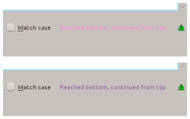

You may remember I announced at the end of June an initiative to polish KDE Workspaces and Applications, called [Walking the Extra Mile](/2012/06/28/walking-the-extra-mile/). We want to make KDE products even more awesome than they already are.

We had a great session at Akademy, but I decided to wait until I am back from vacation to get it really started, as I wanted to be available to help.

What is an extra-mile bug? We defined it during the Akademy session as a bug which meets all of the following criterias:

- It must be a bug or an enhancement, not a feature request
- It affects many users
- It makes using the application harder or less pleasant
- Agreement from the maintainer
- It is easy to fix

We (the KDE Quality team) have already started to file Extra Mile Bugs on Bugzilla, a few of them even got fixed! Here is what we got done so far:

## Plasma

- Black board widget does not contain description ([bug 302636](http://bugs.kde.org/show_bug.cgi?id=302636))
- QML popupapplets lack icon tooltips ([bug 287835](http://bugs.kde.org/show_bug.cgi?id=287835))

## KDE Telepathy

- The reset button in kcm_ktp_chat_appearance is not working ([bug 295106](http://bugs.kde.org/show_bug.cgi?id=295106))
- Group headings are selectable ([bug 303418](http://bugs.kde.org/show_bug.cgi?id=303418))
- Member list of disconnected groupchat still looks "connected" ([bug 294543](http://bugs.kde.org/show_bug.cgi?id=294543))

## Kate

- Hardly readable text in search bar due to poor color contrast ([bug 303974](http://bugs.kde.org/show_bug.cgi?id=303974))

## Gwenview

- Double click no longer toggles full-screen mode ([bug 303048](http://bugs.kde.org/show_bug.cgi?id=303048))

Not super impressive yet, but it\'s a start. With your help we can make the next report longer!

There are many ways you can get involved in this initiative:

- Fixing extra mile bugs
- Marking existing bugs as extramile
- Reporting new extramile bugs
- Triaging extramile bugs (checking whether a bug qualifies as extramile or not)

To learn more about the way the Extra Mile initiative works, go read the [Extra Mile wiki page](http://community.kde.org/Getinvolved/Extra_Mile).
