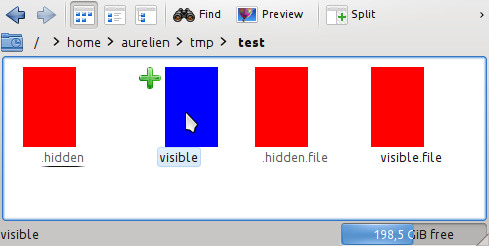
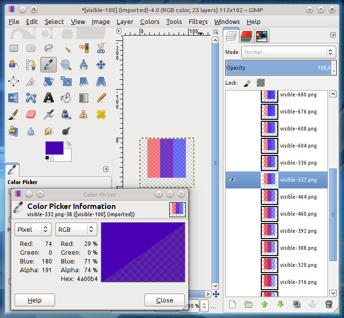

pub_date: 2013-03-27 17:27:52 +01:00
public: true
tags: [KDE, Dolphin, debug]
title: "Fixing a subtle animation bug in Dolphin"
summary: |
    Describes the process and debugging techniques I used to track down and fix a bug in the animation played when the user moves the mouse over file icons in Dolphin

## Noticing the bug

Some time ago I worked on a problem with the mouse over animation in Dolphin. It
was mostly visible with hidden files, because icons for hidden files are semi
transparent. The bug caused icons for hidden files to "blink" when one moved the
mouse over them.

I thought the fix was simple, filed this [review request][first-fix], which
got in.

But that was too easy. Two weeks ago it was pointed out to me that the fix was
wrong, and was causing a blink at the end of the hover animation.  It's the kind
of subtle bugs which you don't see at first, but can't ignore once it has been
pointed out to you. Here is a short video demonstrating it:

<video controls>
    <source src="/2013/03/27/fixing-a-subtle-animation-bug-in-dolphin/dolphin-before.webm">
</video>
_[dolphin-before.webm](dolphin-before.webm)_

## Understanding the bug

How does one debug such a bug? If you are smart enough, you look at the code,
let it sink in you and at some point yell: "AH! THE BUG IS THERE!"

On the other hand, if you're like me, you need more information. Over the years
I built a few techniques to help debugging graphical issues. Here are the ones I
used there.

This is the code we are interested in. It comes from
`dolphin/src/kitemviews/kstandarditemlistwidget.cpp`, in the `paint()` method:

.. sourcecode:: c++

    const KItemListStyleOption& itemListStyleOption = styleOption();
    if (isHovered()) {
        const qreal opacity = painter->opacity();
        // Blend the unhovered and hovered pixmap if the hovering
        // animation is ongoing
        if (hoverOpacity() < 1.0) {
            painter->setOpacity((1.0 - hoverOpacity()) * opacity);
            drawPixmap(painter, m_pixmap);
        }

        painter->setOpacity(hoverOpacity() * opacity);
        drawPixmap(painter, m_hoverPixmap);
        painter->setOpacity(opacity);
    } else {
        drawPixmap(painter, m_pixmap);
    }

_Note: `drawPixmap(QPainter*, QPixmap)` is equivalent to `QPainter::drawPixmap()` as
far as we are concerned_

### Save the pixmaps

When faced with graphical bugs, a trick I often use is to save pixmaps to disk
for review.

In our case, we would like to know what gets painted on the widget at the end of
the `if (isHovered())` block.

First step is to reproduce all paint operations on a QPixmap.

.. sourcecode:: diff

         const KItemListStyleOption& itemListStyleOption = styleOption();
    +    QPixmap pix(option->rect.size());
    +    pix.fill(Qt::transparent);
         if (isHovered()) {
    +        QPainter painter2(&pix);
             const qreal opacity = painter->opacity();
             // Blend the unhovered and hovered pixmap if the hovering
             // animation is ongoing
             if (hoverOpacity() < 1.0) {
                 painter->setOpacity((1.0 - hoverOpacity()) * opacity);
                 drawPixmap(painter, m_pixmap);
    +            painter2.setOpacity((1.0 - hoverOpacity()) * opacity);
    +            drawPixmap(&painter2, m_pixmap);
             }

             painter->setOpacity(hoverOpacity() * opacity);
             drawPixmap(painter, m_hoverPixmap);
    +
    +        painter2.setOpacity(hoverOpacity() * opacity);
    +        drawPixmap(&painter2, m_hoverPixmap);
    +
             painter->setOpacity(opacity);
         } else {
             drawPixmap(painter, m_pixmap);

Now that we have the content of the widget in a QPixmap, we must save it. This
is where one has to be creative to come up with a way to generate names which do
not step on each others: since we are saving images for an animation, we can't
use something like `/tmp/image.png`, otherwise we will only get the last frame.

I decided for this scheme: `/tmp/$filename-$hoverOpacity.png`. Here are the new
changes:

.. sourcecode:: diff

             painter2.setOpacity(hoverOpacity() * opacity);
             drawPixmap(&painter2, m_hoverPixmap);
    +        painter2.end();
    +
    +        const TextInfo* textInfo = m_textInfo.value("text");
    +        QString itemName = textInfo->staticText.text();
    +        QString name = QString("/tmp/%1-%2.png").arg(itemName).arg(int(hoverOpacity() * 1000));
    +        pix.save(name);

             painter->setOpacity(opacity);
         } else {

Note the call to `painter2.end()`: the painter must not be active anymore when
saving the pixmap to disk.

After applying those changes, I restarted Dolphin, moved the mouse over an item,
close Dolphin and looked inside `/tmp` to find a bunch of images here.

Sometimes looking at the images is enough to get a hint at what the problem is,
but unfortunately, not this time. The differences between two consecutive frames
was too small for me to understand what's going on.

I needed images which would be easier to analyze and compare. This brings us to
the second technique I used.

### Easy-to-analyze images

What do I mean with easy-to-analyze images? I wanted images I can inspect with
a color picker and draw conclusions from.

Since the bug is about a transition between two images, I decided to change the
images as following: divide the images in 3 columns, then replace the content of
`m_pixmap` with an image whose columns 1 and 2 are solid red (`#ff0000`) and
replace the content of `m_hoverPixmap` with an image whose columns 2 and 3 are
solid blue (`#0000ff`).

These images would be much easier to analyze because they make it possible to
watch how m_pixmap fades out by looking at the red channel in column 1, how
m_hoverPixmap fades in by looking at the blue channel in column 3, and how the
two mixes by looking at the red and blue channels in column 2.

Here are the necessary changes:

.. sourcecode:: diff

    +    {
    +        m_pixmap.fill(Qt::transparent);
    +        QPainter p(&m_pixmap);
    +        p.fillRect(0, 0, m_pixmap.width() * 2 / 3, m_pixmap.height(), Qt::red);
    +    }
    +    {
    +        m_hoverPixmap.fill(Qt::transparent);
    +        QPainter p(&m_hoverPixmap);
    +        p.fillRect(m_hoverPixmap.width() / 3, 0, m_hoverPixmap.width() * 2 / 3, m_hoverPixmap.height(), Qt::blue);
    +    }
         const KItemListStyleOption& itemListStyleOption = styleOption();
         QPixmap pix(option->rect.size());
         pix.fill(Qt::transparent);

And the result:

_Isn't this beautiful? :)_

I could now look at those images more closely. I like to use GIMP for this,
because its color picker provides the value of the alpha channel and it allows
to load several images as layers with "File > Open as Layers...".

Here is GIMP with all images loaded as layers, showing the color of column 2
when hoverOpacity is 0.532:

An opacity of 0.532 means the image should roughly be half red and half blue.
Furthermore, the middle column should still be fully opaque since this column is
fully opaque on both `m_pixmap` and `m_hoverPixmap`.

But this is not what is happening here: red is at 29%, blue is 71% and alpha is
74%. This gives more insight: the red image (`m_pixmap`) is fading out faster
than the blue image (`m_hoverPixmap`) is fading in.

### Time for some maths

(In this section, to keep formulas short, I am using pixA instead of m_pixmap,
pixB instead of m_hoverPixmap, bg for the background and v instead of
hoverOpacity())

Before my first fix, Dolphin was doing something like this:

1. painter.drawPixmap(0, 0, pixA);
2. painter.setOpacity(v);
3. painter.drawPixmap(0, 0, pixB);

As v increases from 0 to 1, pixB gradually appears over pixA. pixA never goes
away, it is still visible behind pixB.

My first fix changed it to something like this:

1. painter.setOpacity(1.0 - v);
2. painter.drawPixmap(0, 0, pixA);
3. painter.setOpacity(v);
4. painter.drawPixmap(0, 0, pixB);

This is wrong as well. Here is why:

What we want to do is a linear interpolation between two pixmaps, where pixA
slowly fades out as pixB fades in.

Let's assume our background and pixmaps are fully opaque (it simplifies the math
but still exposes the flaw).

Linear interpolation between two alpha-premultiplied images pixA and pixB with a
factor of k is defined with the following formula, where c(x) is any of the
ARGB component of pixel x, normalized to range 0..1:

    c(result) = c(pixB) * k + c(pixA) * (1 - k)

The default composition mode of QPainter, SourceOver, uses the following
formula:

    c(result) = c(pixB) * k + c(pixA) * (1 - alpha(pixB) * k)

_Note: this formula is only valid for alpha-premultiplied images, see QImage doc
for more details_

If pixA and pixB are fully opaque, it can be simplified to:

    c(result) = c(pixB) * k + c(pixA) * (1 - k)

This is the same as the interpolation formula, what could be wrong?

After line 2, the widget shows pixA painted over the background using the
SourceOver formula, with `k = 1 - v`. The temporary appearance is thus:

    c(tmp) = c(pixA) * (1 - v)  +  c(bg) * (1 - (1 - v))
           = c(pixA) * (1 - v)  +  c(bg) * v

After line 4, the widget shows pixB painted over tmp with `k = v`. The final
pixels are thus:

    c(final) = c(pixB) * v  +  c(tmp) * (1 - v)
             = c(pixB) * v  +  (c(pixA) * (1 - v) + c(bg) * v) * (1 - v)
             = c(pixB) * v  +  c(pixA) * (1 - v)^2  +  c(bg) * v * (1 - v)

Which is different from the expected:

               c(pixB) * v  +  c(pixA) * (1 - v)

Both line 2 and line 4 multiplied c(pixA) by `1 - v`, leading to it being
multiplied by `(1 - v)^2`, letting the background shows in by `v * (1 - v)`.

## Fixing the bug

To get the correct result, we need to apply a different painting formula.
Unfortunately, QPainter does not provides an Interpolation mode. It does however
provide a Plus mode, which simply does the sum of each components:

    c(plus) = c(pixA) + c(pixB)

This makes it possible to implement interpolation this way:

First, paint m_pixmap, reduced by `1 - hoverOpacity()` in a transparent pixmap:

.. sourcecode:: c++

    QPixmap pixmap1(option->rect.size());
    pixmap1.fill(Qt::transparent);
    {
        QPainter p(&pixmap1);
        p.setOpacity(1.0 - hoverOpacity());
        drawPixmap(&p, m_pixmap);
    }

Do the same for m_hoverPixmap, reduced by `hoverOpacity()`:

.. sourcecode:: c++

    QPixmap pixmap2(option->rect.size());
    pixmap2.fill(Qt::transparent);
    {
        QPainter p(&pixmap2);
        p.setOpacity(hoverOpacity());
        drawPixmap(&p, m_hoverPixmap);
    }

Then, paint pixmap2 on pixmap1, using CompositionMode_Plus:

.. sourcecode:: c++

    {
        QPainter p(&pixmap1);
        p.setCompositionMode(QPainter::CompositionMode_Plus);
        p.drawPixmap(0, 0, pixmap2);
    }

Now pixmap1 is `m_hoverPixmap * hoverOpacity() + m_pixmap * (1.0 -
hoverOpacity())`. We can paint pixmap1 on the widget:

    painter->drawPixmap(0, 0, pixmap1);

That's it! This version works as expected:

<video controls>
    <source src="/2013/03/27/fixing-a-subtle-animation-bug-in-dolphin/dolphin-after.webm">
</video>
_[dolphin-after.webm](dolphin-after.webm)_

Dolphin from KDE SC 4.10.2 includes this fix. Hope you enjoy your smooth mouse
over animations!

[first-fix]: https://git.reviewboard.kde.org/r/108858/

