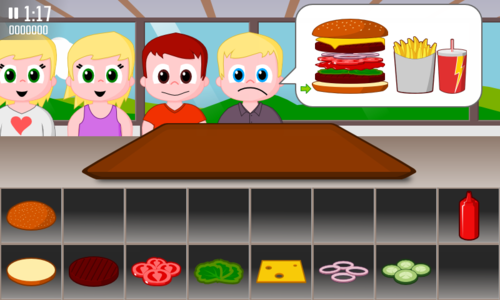

title: Burger Party 0.3 released
public: true
pub_date: 2013-09-14 09:02:00 +01:00
tags: [greenyetilab, burgerparty]

Here is a new alpha version of Burger Party. This new release comes with the following changes:

- Flatter appearance for world 1 customers
- Meal now may or may not include drinks or fries
- Pirate customers for all levels of world 2
- Improved head-up-display, does not overlap with order bubble anymore
- Added cut-scenes when unlocking meal items
- Fixed bug causing burger arrow to sometimes disappear
- Fixed bug which allowed adding multiple copies of the same drink or fries

[Get it now](/projects/burgerparty)!
