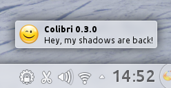

pub_date: 2013-05-15 15:05:44 +02:00
public: true
tags: [kde, plasma, colibri, notifications]
title: "Return of the bird, Colibri 0.3.0"
summary: |
    Announcing a new release of Colibri, an alternative to KDE Plasma notifications

In case you haven't heard about it, [Colibri](/projects/colibri) is an
alternative to KDE Plasma notifications.

Colibri notifications are completely passive: when you move the mouse over them,
they fade out and let you click the content behind them. They also have the
handy ability to concatenate multiple notifications if they come from the same
application (think about your friend who likes to press Enter every five words
on IM...)

It has been a long time (2 years!) since I last touched Colibri code: mainly
because it was working for me, so I spent my time on other projects. With the
release of KDE SC 4.10, I noticed a problem though: there was no shadow behind
the notification bubbles anymore.

This is fixed in 0.3.0. The nice thing about this fix is I was able to drop code
I duplicated from Plasma internals by refactoring Colibri to use Plasma::Dialog.
Less duplicated code should result in a more robust implementation, hopefully
Colibri should be usable without patching for 2 more years :)

Another change I made was moving the project from Gitorious to
[git.kde.org][git], this brings you more translations.

You can get the source code from [download.kde.org][src]. Kubuntu 13.04 users
can also get it from the [Colibri PPA][ppa].

[git]: https://projects.kde.org/projects/playground/base/colibri
[src]: http://download.kde.org/stable/colibri/colibri-0.3.0.tar.bz2.mirrorlist
[ppa]: https://launchpad.net/~agateau/+archive/colibri/
