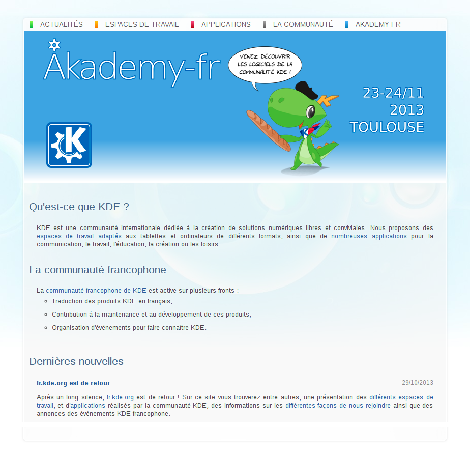

pub_date: 2013-11-15 10:48:01 +01:00
public: true
tags: [fr.kde.org, kde, akademy-fr]
title: "fr.kde.org, Akademy-fr at Capitole du Libre"
summary: |
    fr.kde.org is back, just in time for Akademy-fr

## fr.kde.org is back

For a long (too long) time, the website of the KDE French community was a
placeholder, waiting for a rewrite which was not happening.

With Akademy-fr scheduled for the end of November, we wanted to get the site
back in a useful shape. The danger with those sites is obsolescence: in the
beginning you can reasonably easily find a few people motivated to write
content, but they often loose interest over time and you end up with fresh
announcements of KDE 3.5.4 (it's awesome, you should check it out!)

To avoid this we decided to keep the site as simple as possible, and not
overflowing with content. Adding a new article on a site like this is similar to
adding a new feature in an application: you get to maintain it over time...

The site currently looks like this:

As you can see, the design is based on the current [kde.org](http://kde.org)
design, with a cool banner from [Timothée Giet][timothee] announcing the
upcoming Akademy-fr event.

The main difference with kde.org is the links at the top of the page are not
menus: they are straight links to static pages. I made this decision to avoid
content creep caused by thinkings like "those menus look empty, let's create a
few more articles..."

From a technical point of view, this is a fully static site, generated using
[Jekyll](http://jekyllrb.com). A static site is good enough for our needs and
does not risk causing any security troubles. The theme is obviously based on
kde.org theme with a few tweaks. This is definitely not the most elegant CSS I
have ever written, but it builds on top of the existing kde.org CSS rather than
replacing parts of it, which should make maintenance easier (famous last words)

### Get involved!

While the site is currently in a good shape (I think), contributors are welcome
to keep it alive and up-to-date. Maintenance tasks include:

- Writing news for the front page.

- Refreshing screenshots and descriptions on the "Espaces de travail" and
  "Applications" pages.

- Adding descriptions of other workspaces and applications. Descriptiong for
  Plasma Active and Calligra applications are currently missing for example.

- Catching up with kde.org design when it changes.

If you are interested, can write decent French, join the [kde-events-fr][]
mailing list.

[kde-events-fr]: https://mail.kde.org/mailman/listinfo/kde-events-fr

[timothee]: http://timotheegiet.com/blog/

## Akademy-fr

As I mentioned above, one of the main reasons I wanted to get fr.kde.org finally
back into shape was [Akademy-fr][akfr]. Akademy-fr is a yearly two-day KDE event
organized by the [Toulibre](http://toulibre.org) association in Toulouse. During
these two days we propose a mix of talks and workshops around KDE and Qt. It is
more end-user oriented than Akademy, but we do have technical stuff as well.

For the last two years Akademy-fr has been included in a bigger event called
[Capitole du Libre](http://2013.capitoledulibre.org). This year is similar, with
Capitole du Libre hosting Akademy-fr, a JavaScript conference organized by
[FranceJS](http://francejs.org), as well as Lua and OpenStack workshops.

This year I am giving a talk about [Kdenlive](http://kdenlive.org), titled
"Comment ne pas endormir vos invités devant le film de vos dernières vacances
grâce à Kdenlive" which can be translated to "Using Kdenlive to prevent your
guests from falling asleep while watching the movie of your last holidays". It's
been a long time since my last talk, let's hope it goes well!

[akfr]: http://2013.capitoledulibre.org/programme/conferences-akademy-fr.html
