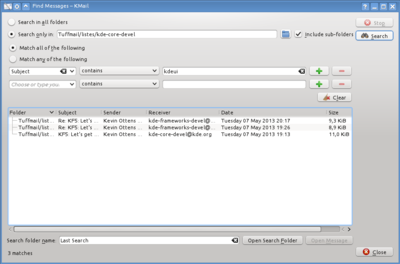
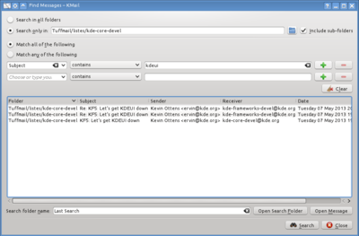

pub_date: 2013-06-20 17:31:14 +02:00
public: true
tags: [kde, kdepim]
title: "Getting started on KDEPIM"
summary: |
    A short summary of the work I have been doing so far on KDEPIM

As you may remember, I have been working on KDEPIM lately. For now I have mostly worked on KMail, getting simple changes done to get used to the project.

## Refreshed search dialog

The layout of the search dialog has been refreshed, it used to look like this:

<!-- thumbimg("search-dialog-before.png", alt="KMail search dialog, before", size=400) -->

In 4.11 it now looks like this:

<!-- thumbimg("search-dialog-after.png", alt="KMail search dialog, after", size=400) -->

I also spent a bit of time working on behavior: you can now press Enter right after entering a search pattern to start a search. It's a little thing, but it is the kind of changes which makes the user experience smoother.

## Small is beautiful

Or so they say. We developers are used to high-resolution screens but many users use netbooks with 1024x600 screens (the horror!). Unfortunately, KMail configuration dialog did not fit in such a small rectangle, so I massaged the various configuration pages to reduce the minimum necessary size for the dialog. The minimum size for the dialog is now 780x567 pixels on my machine (you may get different results depending on widget style and fonts).

## Miscellaneous fixes

I also made some smaller fixes:

- I hunted through all the code to remove as much Windows-95-like widget borders as possible.

- The spell-checker in the compose window is now easier to toggle on and off. If it looked like it couldn't be turned on for you, this should help.

- The "Select folder" dialog (the one which pops up when you press J to jump to a folder or M or C to move or copy messages to a folder) received a few fixes.
    - The folder tree now always have an item selected when you type letters to filter its content.
    - <strike>It no longer leaves the previous folder selected as it used to sometimes do.</strike> 
    Update: this sentence was ambiguous, the dialog still remembers the last folder you selected with it. The change actually fixes a bug where sometimes after selecting a new folder with the dialog, the previously selected folder in the main window would not be unselected, leaving you with two folders selected (see [review request 111100](https://git.reviewboard.kde.org/r/111100/) for more details)

## More to come

Some of the work I started spiralled into big refactorings, so I postponed them for now and created less invasive fixes for 4.11. There should be enough time to get them in as well as some more important new features I have in mind in KDEPIM 4.12.
