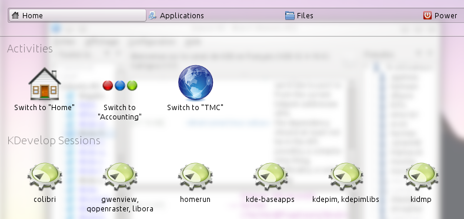
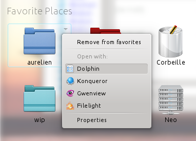
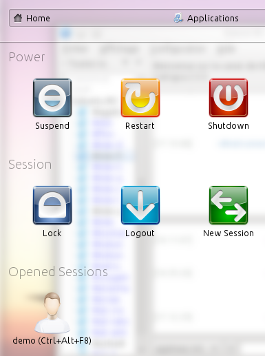

pub_date: 2013-02-27 17:47:41 +01:00
public: true
tags: [kde, homerun]
title: "Homerun 0.2.1 released"
summary: |
    Homerun 0.2.1 brings a few new features, like "Single runner query mode" KRunner support and support for multiple actions per result item

Was about to blog about the 0.2.0 release yesterday, but some bugs sneaked in at
the last minute, so here comes Homerun 0.2.1. Here is an overview of the main
changes.

## "Single runner query mode" support

Homerun 0.1.x can show results from KRunner runners through the Runner source,
which lets you combine a set of runners and query them for results.

A little-known feature of KRunner runners is the "Single runner query mode".
This feature means Homerun can take advantage of these special runners to
display a list of items without requiring the user to search for something.

This makes it possible, for example, to add the Activity runner to your Home tab
and switch between running activities, or to add the Kate or KDevelop session
runners and get a quick list of available sessions.

In Homerun 0.2.1, these runners are directly listed as Homerun sources in edit
mode, making it easy to add them to your tabs.

This is still experimental though: one important limitation right now is that
there is no way for such sources to refresh themselves. This means that your
list of activities is not going to update itself as you start or stop
activities. It also means the "Recent documents" runner is not yet a suitable
replacement for the "Recent documents" source since it cannot refresh itself :/

## Multiple actions per item

Homerun sources now have the ability to expose additional actions for each item.

The other actions are accessible through a context menu, which can be triggered
by:

- Left-clicking the arrow in the top-right corner of the item
- Long-clicking the item
- Right-clicking the item
- Pressing M or the "Menu" key

File-oriented sources like the "Dir", "Recent Documents" and "Favorite Places"
sources take advantage of this by showing relevant "Open With" actions and a
"Properties" action. This makes it possible to open a file with another
application or to open a folder with Dolphin instead of browsing it within
Homerun.

The "Recent Documents" source also adds an action to let you remove an item from
the list.

Actions exposed by runners are also displayed in this context menu.

Note that favorite handling has also been moved to this menu, making it more
unlikely to remove a favorite place by mistake.

## Improved Power tab

The Power tab received a few improvements:

- Unavailable sleep modes are not listed anymore.
- Opened sessions are now directly listed below the session items, making it
  fast and easy to switch between opened sessions.

## Visual changes

Homerun is a fullscreen launcher, it is now even more fullscreen: the borders
around the screen has been removed, reducing clutter a bit.

Header titles are now aligned to the left of the screen, they look less odd on
tabs which do not have many items, such as the Power tab.

In containment mode, a shadow is now shown behind the text. This
improves the readability of text over highly-constrasted wallpapers.

## Conclusion

That's it for this version. You can get it from [download.kde.org][tarbz2]. Note that
this new version requires KDE SC 4.10.

[tarbz2]: http://download.kde.org/unstable/homerun/src/homerun-0.2.1.tar.bz2
