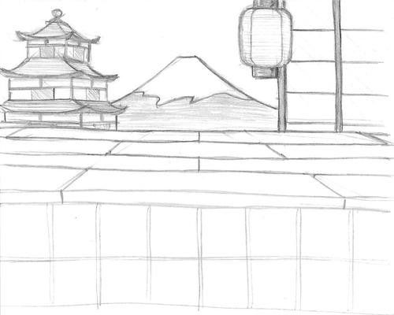

title: Japan world background
public: true
pub_date: 2013-11-16 11:33:00 +01:00
tags: [greenyetilab, burgerparty, gamedev]

I started working on a third world for Burger Party: Japan. I don't have much
for now, except for the ninja I drew a long time ago, which I need to redo using
flat shading.

Yesterday I did a bit of sketching and came up with this drawing for the
background:

Next step: redrawing it with Inkscape.
