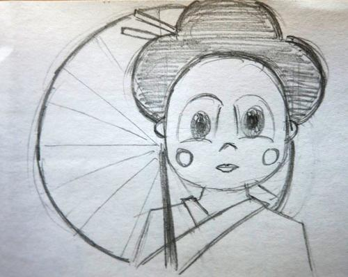
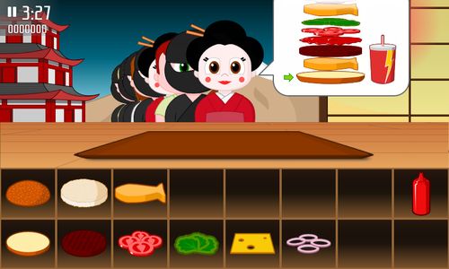

title: Japanese Girl
public: true
pub_date: 2013-12-16 21:24:00 +01:00
tags: [greenyetilab, burgerparty, gamedev]

This weekend I drew a new customer for the Japan world of Burger Party: a Japanese girl in traditional costume.

As usual, I started with a sketch:

Then redrew it with Inkscape. I eventually decided not to draw the sunshade as I was worried it would hide the other customers too much. Here is the first version from within the game:

Hope you like it! This new customer will be part of Burger Party 0.8.
