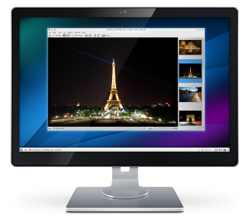

pub_date: 2013-02-10 01:00:31 +01:00
public: true
tags: [KDE, Paris, Dinner]
title: "KDE Dinner in Paris"
summary: |
    Setting up the first KDE Dinner in Paris to celebrate the release of KDE SC 4.10

Nowadays, most of the KDE events happening in France are organized in Toulouse,
thanks to the awesome work done by the KDE people from the Toulibre association.

Not much has happened in Paris, which I find a bit sad. In an effort to get KDE
users and contributors in Paris to get to know each others I thought about
organizing KDE Dinners in Paris on an hopefully regular basis.

Our first dinner is expected to happen this month and will also be the occasion
to celebrate the release of KDE SC 4.10.

I don't want to commit to something too constraining for now. I would be happy
if we get a small dozen people to meet every three months. This frequency means
    one dinner out of two will also double as a small KDE SC release party.

We are still bootstrapping this idea so it needs a bit of promotion, hence this
short article. If you are around Paris at the end of the month and want to
spend a nice evening with friendly KDE users and contributors, you are welcome
to join us!

I set up a Doodle to organize this event, with many possible dates. You can
use this link to subscribe: <http://www.doodle.com/6uwauc5eyp3sbfen>.

*<small>Paris pictures from [Julien Chodlewski][kenofhu], [drs1ump][], [Mystic Pics][mystic] and [Yann Caradec][ycaradec]</small>*

[kenofhu]: https://www.flickr.com/photos/kenofhu/8024237796/
[drs1ump]: https://www.flickr.com/photos/drs1ump/8173283928/
[mystic]: https://www.flickr.com/photos/mystic_pics/5911866514/
[ycaradec]: https://www.flickr.com/photos/la_bretagne_a_paris/2227000838/
