pub_date: 2013-12-05 14:46:35 +01:00
public: true
tags: [kde, python, cmake, graphviz]
title: "Dependency diagrams for KDE Frameworks 5"
summary: |
    Generating fancy diagrams for KDE Frameworks using CMake, Graphviz and Python.

For a long time we have been missing diagrams for KDE Frameworks, to make it easier to grasp the dependencies of the various frameworks. Since I like working with images I decided to tackle on this.

I did some research and found out CMake comes with a `--graphviz` option to generate .dot files, which can then be fed to the `dot` tool from [Graphviz][] to generate pngs, svgs or other formats.

Armed with this, I put together two scripts :

- `kf5dot-prepare` runs `cmake --graphviz` on all frameworks, generating .dot files,

- `kf5dot-generate` then massage the .dot files, aggregate them and generate new .dot files which can then be piped to `dot` for final rendering.

My initial goal was to generate one diagram showing all the frameworks, but this is way too messy, so I ended up extending `kf5dot-generate` to be more versatile. Right now the output can be customized to generate a diagram of all the dependencies of one framework, to include or not Qt libraries, and to show or hide targets within frameworks.

I also used `tred`, another tool from Graphviz, to remove unnecessary links. For example if you have this graph definition:

	digraph G {
		A -> B -> C # A depends on B, which depends on C
		A -> C # A depends on C
	}

You get this output:

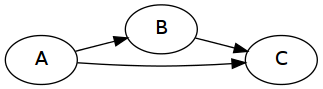

With `tred`, the link from A to C is removed, since you can already go from A to C through B:

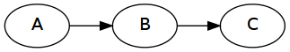

This helps making dense diagrams more readable, but it also hides some dependencies. Depending on the reason you are looking at the diagrams, it may or may not be a problem.

# Examples

Here is a selection of the generated diagrams. The "simplified" versions have been run through `tred`.

## Some tier 1 frameworks

Mostly useful to check which Qt libraries they use:

### KWindowSystem

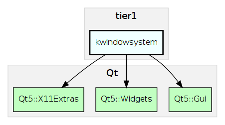

### Solid

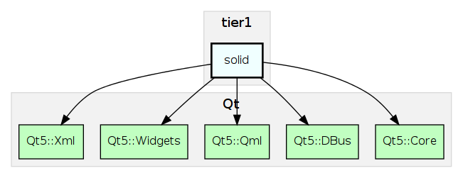

## Some tier 2 frameworks

### KAuth

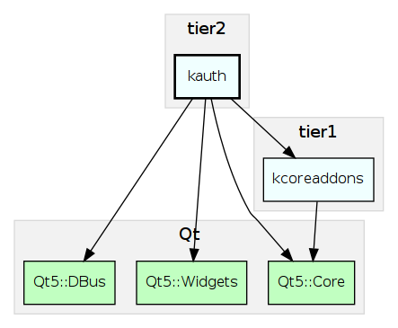

### KCompletion

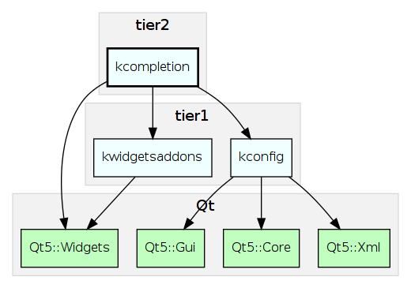

### KJobWidgets

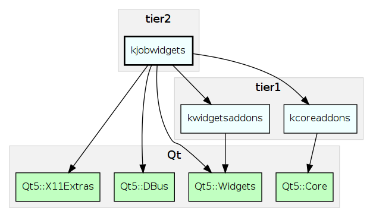

## Some tier 3 frameworks

To reduce clutter I removed the Qt libraries for tier 3 frameworks.

Some of them are readable:

### KDESu

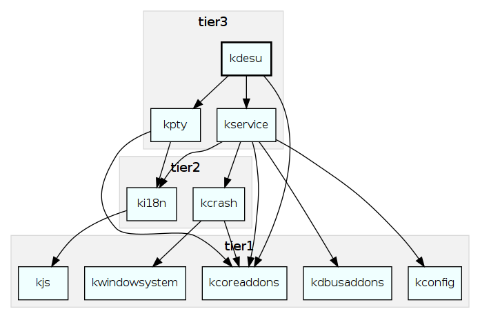

### KIconThemes

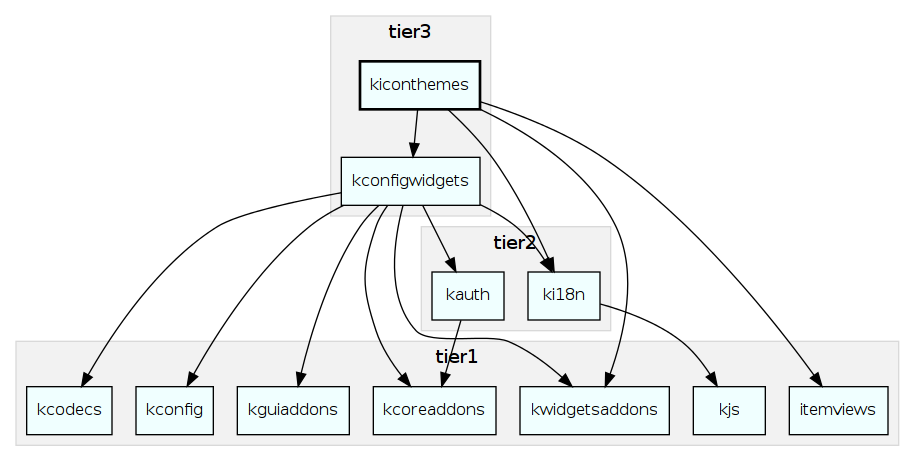

Others are too crowded unless they are simplified:

### KIO

[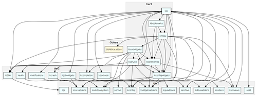](tier3-kio.png)

Simplified:

[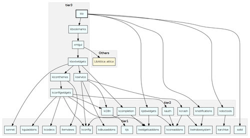](tier3-kio-simplified.png)

### KCMUtils

[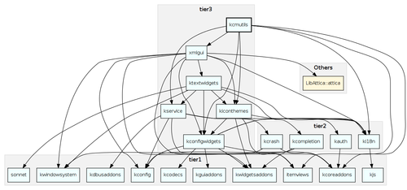](tier3-kcmutils.png)

Simplified:

[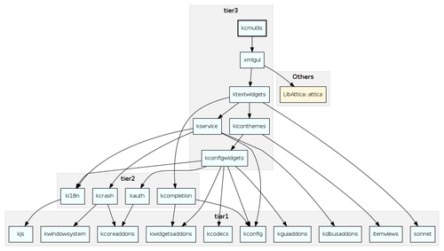](tier3-kcmutils-simplified.png)

### All of KF5

The big, crowded, overall diagram (and this is the simplified version!):

[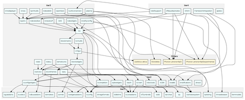](kf5.png)

## Useful .dot files

I took some extra care to ensure the generated .dot files are readable enough to be useful even if the resulting diagram is not: the code is correctly indented and relations are placed close to their relevant targets. For example, here is the .dot file for all frameworks: [kf5.dot](kf5.dot).

## Under the hood

The scripts currently live in a git repository: [kde:scratch/gateau/kf5dot][src]. `kf5dot-prepare` is a shell script. `kf5dot-generate` is written in Python and uses [yapgvb][], a Python lib to read .dot files.

[yapgvb]: https://code.google.com/p/yapgvb/

## What's next

In the long term I would like to include these tools in our API documentation generation procedure so that when you browse the API of a framework on api.kde.org you get a diagram of its dependencies.

[Graphviz]: http://graphviz.org

[src]: http://quickgit.kde.org/?p=scratch%2Fgateau%2Fkf5dot.git&a=tree

