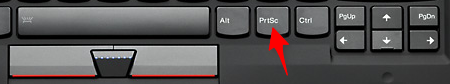

pub_date: 2013-08-01 23:53:54 +02:00
public: true
tags: [lenovo, tips, xmodmap]
title: "Remapping keyboard keys on Lenovo Laptops"
summary: |
    Latest Lenovo laptops are great, but their keyboard layout suffer from a very annoying flaw.

I recently got myself a new laptop. It went for a Thinkpad and I am quite happy with it, except for a few minor annoyances. The first one I want to cover is that one:

Yes, the "Print Screen" key is placed between "Alt" and Ctrl". While this key is handy to take screenshots, it is a lot more annoying when you have clumsy fingers and end up holding down "Print Screen" instead of "Alt" or "Ctrl", as it ends up spawning a horde of ksnapshots...

It is also sitting in the place where my fingers are used to find the "menu" key, a key I actually use quite often, especially to fix typos while typing: "Ctrl+left" to move to the word underlined with red, "Menu" key, select correct word in the suggestions, done.

After running "killall ksnapshot" one time too many, I decided to do something about that issue.

## Xmodmap to the rescue

My goal was to remap the "Print Screen" key to the "Menu" key, and the odd rectangular key next to the volume keys to "Print Screen" (because I do need a quick way to fire ksnapshot).

I started by identifying the key symbol for the "Print Screen" and the odd rectangular keys with `xev`, then created a file named `.Xmodmap` in my home folder, with the following content:

    ! Print Screen => Menu
    keycode 107 = Menu
    ! Button on the right of mute => Print
    keycode 156 = Print

After logging out and back in, I now have a saner keyboard layout.

There is only one drawback to this tip: when you are using an external keyboard and try to take a screenshot with the "Print Screen" key, don't be surprised if it opens the context menu instead :)
