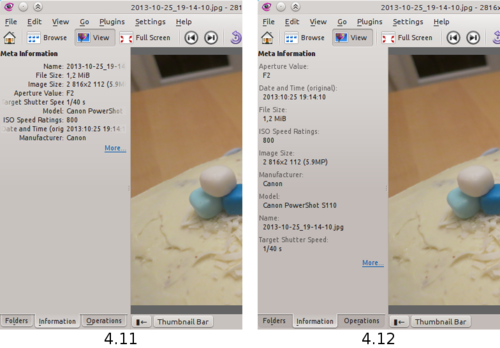
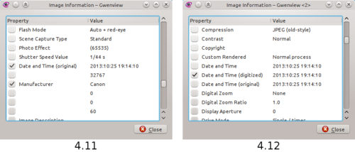

pub_date: 2013-12-12 18:00:25 +01:00
public: true
tags: [KDE, Gwenview]
title: "What's new in Gwenview 4.12?"
summary: |
    A (short) summary of the changes in Gwenview 4.12

With KDE Applications 4.12 about to be released, it's time to look at the changes which went in Gwenview during this cycle. Unfortunately, I am afraid the answer is : not much.

I just went through the revision log and despite the usual bug fixes, I could only find two relatively significant changes.

## Nicer meta information sidebar

I have never been happy with the way the sidebar displayed meta information about the image. I finally took some time to work on it. Here is a before / after:

As you can see, I went for a stacked design with wrapping text. It makes better use of the space, providing more room for the content.

## Nicer meta information window

Related to the meta information sidebar, I worked a bit on the window which opens when you click the "More..." link in the meta information sidebar. The properties listed in the window were not sorted, making it difficult to find what one is looking for. They are now sorted alphabetically by property keys, and some useless properties, either unnamed or filled with large binary content, are now hidden. 

Retrospectively, I should have added a search line in there as well. Unfortunately it is too late for 4.12.

## What about 4.13?

Not much planned from my side for now, as you guessed I am not very active on Gwenview these days. There is a fancy new feature nevertheless, which I know some of you have been asking for a while: raw file preview support!

Thanks to great work from Martin Kyral, Gwenview can now display previews embedded within raw files. I am not the target audience for this feature, so I'll quote Martin instead:

> [Raw support] theoretically enables gwenview to support everything dcraw supports (I haven't found a raw file that gwenview doesn't show with this patch). The patch does not perform full demosaicing nor any tweaks (set white balance or so) and I don't think it shall - digikam, darktable or rawtherapee are much more suited for developing the 'digital negatives'.

That's it for this cycle. Hope you are going to enjoy your (slightly) refreshed Gwenview 4.12!

