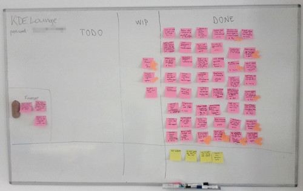

pub_date: 2014-04-30 10:26:20 +02:00
public: true
tags: [kde, kf5, kapidox]
title: "Back from the KDE Frameworks Sprint"
summary: |
    Moving around sticky notes in Barcelona...

Last week I attended the KDE Frameworks Sprint, held in Blue Systems Barcelona office. Kevin put together the now traditional sticky note board and we started cranking through the tasks. I think we were quite productive, as this picture of the board at the end of the sprint can attest:

I spent most of my time working on translation support, ironing out details to get them to install properly and working with David on the release tarballs scripts. I also worked a bit on [KApidox][], the code generating API documentation for KF5 on [api.kde.org](http://api.kde.org). I updated the script to match with the latest framework changes and switched to the [Jinja2](http://jinja.pocoo.org) template engine. Using Jinja will make it possible to generate an up-to-date list of frameworks on the landing page, based on the information from the framework `metainfo.yaml` files. I already have a branch which creates this list, but before I deploy it I want to fix the dependency diagrams on the server. Hopefully I'll figure it out this week.

[KApidox]: http://quickgit.kde.org/?p=kapidox.git