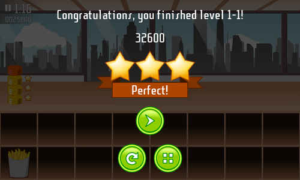
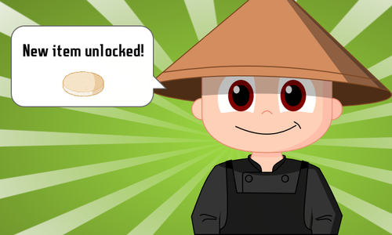

title: Burger Party 0.10
public: true
pub_date: 2014-01-23 17:22:00 +01:00
tags: [Greenyetilab, burgerparty]

Here is a new version of Burger Party.

The main change in this new version is the new way to gain stars. You used to get stars depending on your score, this has changed: in this new version, customers will now pay you between 1 and 3 coins, depending on how satisfied they are. When you have enough coins, you get a star. Stars cost more and more as you progress through levels.

*I was fast enough to get 3 coins from my first customer, but it looks like this one is only going to give me 1 or 2...*

Additionally, if you manage to satisfy all customers of a level, you now get a "Perfect" ribbon to highlight your outstanding performance.

Another important change is the size and variety of burgers: in advanced levels, customers will now order a mix of small and large burgers, and some burgers may have a middle bun.

I also worked a bit on the Japan world. It no longer uses a place-holder character for its "unlocked item" screen. Instead a Japanese cook will tell you about unlocked items:

Some work has been done on mini-games as well.

Air Burger received a new set of tiles, and the "bad cheese" on the ground has been replaced by proper spikes.

A new enemy type has been added to Burger Vaders: a burger which looses one ingredient each time you hit it. Sounds have been improved, and extra guns are now temporary, in an effort to make the game a bit more difficult.

Burger Crush now has sounds when you destroy items. It is also a bit more forgiving: destroying 3 items now gives you a one second bonus: it used to only give you a time bonus if you managed to destroy 4 items or more at a time.

Finally some minor changes made it in as well:

- A "mute" button to turn off music and sound effects has been added to the start screen and to the pause overlay
- Overlay screens no longer have blurry borders
- The yeti on the loading screen is now correctly scaled

[Get it now](/projects/burgerparty/)!

PS: The sharpest eyes among you might have noticed I went from 0.8 to 0.10. 0.9 was expected to hit the Internet yesterday, but I found an annoying regression in it. Since it had already been uploaded on Google Play, I had to bump the version number.
