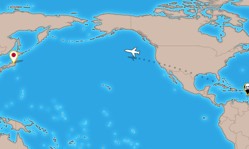

title: Burger Party 0.11
public: true
pub_date: 2014-02-13 23:13:00 +01:00
tags: [greenyetilab, burgerparty, gamedev]

## Meh, ads

This new version is a bit special. It is the first one which adds something I was not really looking forward to add: ads. I thought about this for a long time. I don't like ads much so my initial plan was to sell Burger Party for a small fee. I changed my mind after I went through the "Top Grossing Android Apps" category on Google Play Store: the first non-free app there is #38! And this app is Minecraft, which is massively well known. Clearly, Android users do not like to pay for applications. It might be different on other markets: for example Blackberry users seem to be more willing to pay for games. If/when I publish Burger Party on Blackberry World, I might try to sell it there, instead of relying on ads.

Still, I want this game to be kid-friendly, and kids should not be exposed to advertisement when it can be avoided. Therefore my plan is to add an In-App-Purchase to let you remove the ad. This is not done yet though, and I may postpone this until after the first public release. Right now my focus is on getting Burger Party out as soon as possible.

Right now there is only one ad. It shows up under certain circumstances when you start the game. The current settings are: it won't show up for the first 8 plays, and then it won't show up more often than once every 12 minutes. I plan to adjust those settings based on your feedback: I don't want ads to be too intrusive. Actually, the main reason for introducing ads early is to have enough time to tweak them before the public release.

I made a bit of research on ad networks and decided to use [Heyzap][] for now. This ensures you get only game-oriented ads, which I find less annoying than ads trying to sell you clothes, travels, cars...

[Heyzap]: http://heyzap.com

## Cut scenes

This new version does not bring a lot of exciting changes but ads is not the only new "feature": I also finally started to work on cut scenes. I added a short cut scene which appears when you finish a world, showing an airplane travelling to the new game area.

I am not entirely happy with the map for now, so I may redo it later to give it a more cartoonish appearance. I also need to put together a longer cut scene for the end of the game.

## New permissions

When you install this new version, you will notice Burger Party now requests a few permissions. It needs the permission to reach the network to download ads. It also ask for the permission to write to the sdcard. This is because of a new logging facility: a log is now created in the /burgerparty folder on your sdcard. I hope this helps track down difficult-to-reproduce issues.

That's it for [this new version](/projects/burgerparty/), hope you enjoy it!
