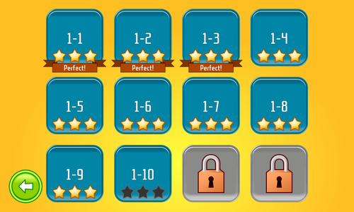

title: "Burger Party 0.14"
public: true
pub_date: 2014-04-19 11:03:18 +01:00
tags: [greenyetilab, burgerparty, gamedev]

Here is Burger Party 0.14. No ground-breaking changes in this new version, except for the fact worlds now contain 12 levels again. I made this change because I want to add more items, but I don't want every level to unlock a new item: one should not spoil players :).

Special note for testers: the addition of new levels means you are likely to end up with a weird situation in your level list: if you already finished world 1, level 2-1 is unlocked, but the new levels (1-10, 1-11, 1-12) are still considered new so level 1-10 will be available but with zero stars, and levels 1-11 and 1-12 will be locked. Just finish the new levels and your level list will look normal again. That cannot happen for new players, it is part of the joys of being a tester...

Other than that, version 0.14 comes with the following changes:

- 3 new achievements:
    - Creative: create 10 different burgers in sandbox mode.
    - Fan: play 40 levels.
    - Burger Apprentice: create 25 burgers.
- Fixed a bug which made it possible to skip a level by pressing the "next level" button twice.
- Fixed text overflowing out of screen in the "new item screen" when playing in French.
- Reworked Japan world to add more variety in customers.
- Reworked the background of achievement notifications.

That's it for this [new version](/projects/burgerparty), hope you like it.
