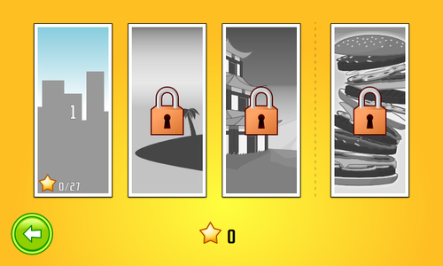

title: Burger Party 0.8
public: true
pub_date: 2014-01-12 18:17:00 +01:00
tags: [greenyetilab, burgerparty, gamedev]

Happy new year!

To celebrate the arrival of 2014, here is a new version of Burger Party.

The main change in this new version is the introduction of mini-games. Each world now comes with one mini-game, which you can unlock by collecting stars.

Some user testing revealed the sandbox mode was confusing for first-time players: they often selected the sandbox mode instead of the "US World" button. To avoid this, the sandbox mode now requires 3 stars to unlock, removing the question of which button to press when presented with the world screen for the first time.

I was also annoyed by the overall appearance of the US world, it looked too grey. I fixed this by adjusting the counter and the ceiling to be more colorful.

The Japan world received some work as well: the ninja has been redrawn to use the same flat drawing style as the other customers, and a new customer has been introduced: a Japanese girl in traditional costume, which [I wrote about earlier](/2013/japanese-girl).

Finally some smaller changes made it in as well:

- An about screen has been added.
- The background of the new item screen is now animated.
- Star count is now visible in the world list screen.
- [libgdx][], the library used to develop the game, has been updated to version 0.9.9.
- Images are now more compact, the game should use a bit less space.

[Get it now](/projects/burgerparty/)!

[libgdx]: http://libgdx.badlogicgames.com/
