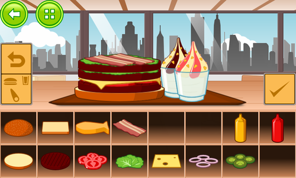

title: "Burger Party 1.0rc1, We Are Getting There!"
public: true
pub_date: 2014-09-01 23:36:28 +01:00
tags: [Greeenyetilab, burgerparty]

This new release of Burger Party is special: as you guessed from the title of this article, its version number is not 0.17 but 1.0rc1.

RC1. Release Candidate 1. About time.

Yes, this means unless something goes wrong with this version, I plan to bump the version number to 1.0 and finally release the first public version of Burger Party on Google Play.

So, what's in the box? Quite a few changes:

- Three new ingredients have been added: bacon and two sundaes (chocolate and strawberry). To accommodate those new ingredients, new levels have been added: worlds now come with 15 levels.

- The appearance of many ingredients have been reworked:
    - Cucumbers got turned into pickles
    - Cheese color is less saturated and its shadows have been improved
    - Salad has been redrawn
    - Meat is a bit tighter
    - The bottom bun is less round, making it look nicer when used as a middle bun

- More sound effects:
  - All images of the "New World" animation have sound effects

  - There is now a sound effect when one gets a "Perfect" and a short jingle for the "New Item Unlocked" screen

  - The "Game Over" jingle has been redone

- There is now a tutorial when playing level 1.1

Burger Party 1.0rc1 also packs some minor changes:

- A reworked loading image: it now uses flat shading and is smoothly scaled on
  bigger screens

- The "New Item" animation on the level list has been improved

- Big fries appear earlier (level 2-6 instead of 3-6)

- The game is a little bit easier

- The number of burgers required for the "Apprentice", "King" and "God" achievements have been doubled

- There is now an indicator which appears over the "Achievements" button when a new achievement has been unlocked

- The layout of the "Pause", "Level Finished" and "Game Over" overlays has been reworked. In particular, the "Pause" and "Level Finished" overlays now provides an "Achievements" button

Since this is a release candidate, your feedback is more important than ever, [get the latest version](/projects/burgerparty/#get-it), give it a good try and hopefully 1.0 should be there soon!
