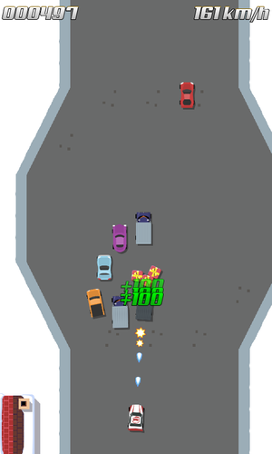
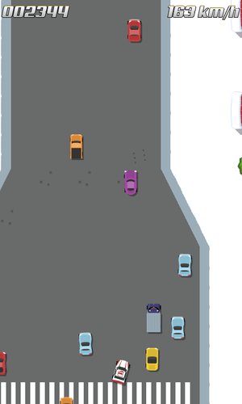
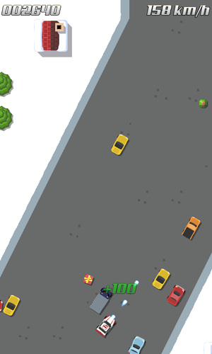
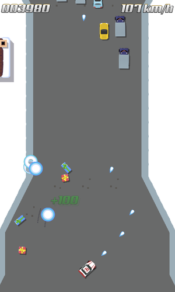

title: "Christmas Preview"
public: true
pub_date: 2014-12-26 19:58:48 +01:00
tags: [Greenyetilab, Race, Christmas, preview, Santa Claus]
summary: Here is the very first preview of the next game I am working on, it is a top-down car game, and since it's Christmas you get to drive Santa Claus car in this exclusive version!

It's Christmas time at Green Yeti Labs! I have a (one day late) little present for all of you: a very early version of what I have been working on for a few weeks. As I mentioned in an [earlier post][experiments], it's a top-down car game. It has changed quite a bit since this post though.

Here is the pitch: some yet-unnamed villain decided to steal all the Christmas gifts from Santa Claus head quarters. That evil person got his minions to load all the gifts in their trucks, they are currently escaping on the road! Santa is furious. Unfortunately, his sled is out for its yearly check up before the great day, so he jumps in his car and goes after the bad trucks.

You play as Santa: chase the bad trucks, take them down with your ice cannon and get the gifts back. Be careful not to shoot the innocent cars on the road! Oh and mind the mines, they were probably left there by the aforementioned unnamed villain...

As I said, it's a very early preview: there is neither music nor sound effects, graphics need to be refined (I still use some nice free car sprites from [opengameart.org][car-park]) and I am still experimenting with the game play and with the car control, it does not even have a proper name or an icon for now! It's nevertheless already quite fun, and I would love to get feedback from you. You can get it as an .apk for your Android phone or tablet:

<a href="/storage/race/race-141226-1.apk" class="dl-button">Get the APK</a>

I am especially interested to hear from you regarding the different input methods: which method do you find the easiest to use?

[experiments]: /2014/game-and-toolkit-experiments/
[car-park]: http://opengameart.org/content/parking-game-pack
