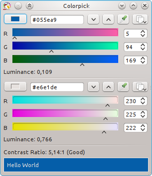
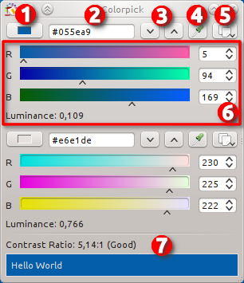
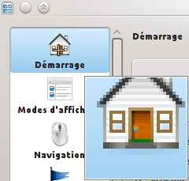
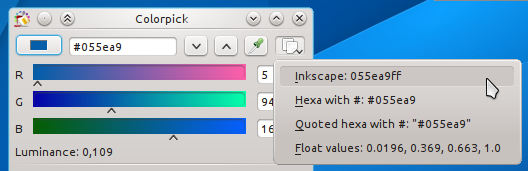

pub_date: 2014-11-26 18:36:38 +01:00
public: true
tags: [KDE, side-projects, Colorpick]
title: "Colorpick"
summary: |
    Introducing one of my many-side projects: Colorpick

Recently I wrote about my so-called "[lightweight project management policy][lpmp]". I am going to start slowly and present a small side-project: Colorpick.

Colorpick is a color picker and contrast checker. I originally wrote it to help me check and fix the background and foreground colors of the Oxygen palette to ensure text was readable. Since then I have been using it to steal colors from various places and as a magnifier to inspect tiny details.

The main window looks like this:

Admittedly, it's a bit ugly, especially the RGB gradients (KGradientSelector and the Oxygen style do not play well together). Nevertheless, it does the job, which is what side-projects are all about.

Here is an annotated image of the window:

1. The current color: clicking it brings the standard KDE color dialog. The main reason it's here is because it can be dragged: drag the color and drop on any application which supports color.

2. The color in hexadecimal.

3. Luminance buttons: click them to adjust the luminance of the color.

4. Color picker: brings the magnifier to pick a color from the screen. One nice thing about this magnifier is that it can be controlled from the keyboard: roughly move the mouse to the area where you want to pick a color then position the picker precisely using the arrow keys. When the position is OK: press Enter to pick the color. Pressing Escape or right-clicking closes the magnifier.

    

    _Picking the color of the 1-pixel door knob from the home icon. The little inverted-color square in the center shows which pixel is being picked._

5. Copy button: clicking this button brings a menu with the color expressed in different formats. Selecting one entry copies the color to the clipboard, ready to be pasted.

    

6. RGB sliders: not much to say here. Drag the cursors or enter values, your choice.

7. Contrast test text: shows some demo text using the selected background and foreground colors, together with the current contrast value. It lets you know if your contrast is good enough according to <http://www.w3.org/TR/WCAG20/#visual-audio-contrast>.

Interested? The project is on GitHub at <https://github.com/agateau/colorpick>. Get it with `git clone https://github.com/agateau/colorpick` then follow the instructions from the [INSTALL.md][] file.

[lpmp]:  http://agateau.com/2014/lightweight-project-management
[INSTALL.md]: https://github.com/agateau/colorpick/blob/master/INSTALL.md
