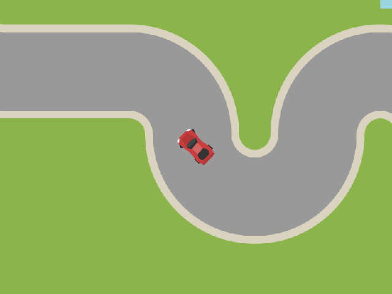

title: "Game and Toolkit Experiments"
public: true
pub_date: 2014-11-27 09:30:35 +01:00
tags: [greenyetilab, ]
summary: Taking a break from Burger Party marketing, I decided to do some experiments to decide what my next game will be and what tools I will use to build it.

Taking a break from doing some marketing for Burger Party, I decided to do some experiments to decide what my next game will be.

Starting a new game is the right time to experiment with other technologies. Burger Party is built with [LibGDX][] but my preferred language is actually Python, so I started looking around for a Python-based game library which would let me create games for mobile devices.

I found [Kivy][] and started playing with it. I was disappointed however when I tried to get my prototype on my phone as I could not get the tools to create a .apk to work and the prototype was way too slow to be usable when running in Kivy launcher. Too bad, no Kivy for now, but I'll definitely give it another try for my next-next-game. Based on how long it took me to get Burger Party done, this leaves ample time for Kivy tooling to mature :)

Next on my list was [Phaser][], a Javascript game framework. Having rewritten my prototype using it, I was again disappointed by the performances: Neither my tablet (Nexus 7 2012, yes, a bit old) nor my phone (Nexus S, really old!) could keep up with it.

I decided to end my framework explorations there and went back to LibGDX. At least this time I get to use the latest version with shiny new toys^Wclasses. I also switched from trusty Eclipse to Android Studio, which I like so far. I am particularly fond of the VIM plugin, it is quite close to the original.

You may be wondering about the game itself. It's still very much in flux, but it looks like it is going to be a top-down car game, using tile-based maps. It currently looks like this (car comes from this [parking game pack][car]):

_I told you it's a prototype!_

Right now, the goal of the game is to complete the track as fast as you can, but only time will tell whether there will be other cars, a timer to beat or something else I haven't thought about yet.

Last week-end we had guests at home and the kids got to play with an early version. They liked it so far, which I take as a good sign. That version used primitive home-made vector math for the car physics, but I could not get my math to produce convincing skids (and I really want the car to skid!), so I am currently rewriting it with [Box2D][], which I wanted to learn anyway.

Writing a top-down game may not be the best way to get started on Box2D though: you have to create a world with zero gravity so that the car does not fall down to the bottom of the screen, and as such many features such as drag must be implemented by hand, because as far as Box2D is concerned, your cars are floating in the void. Luckily, I found this great tutorial on [simulating a top-down car with Box2D][b2dtut] which helped a lot.

[LibGDX]: http://libgdx.badlogicgames.com
[Kivy]: http://kivy.org
[Phaser]: http://phaser.io
[b2dtut]: http://www.iforce2d.net/b2dtut/top-down-car
[car]: http://opengameart.org/content/parking-game-pack
[Box2D]: http://box2d.org
