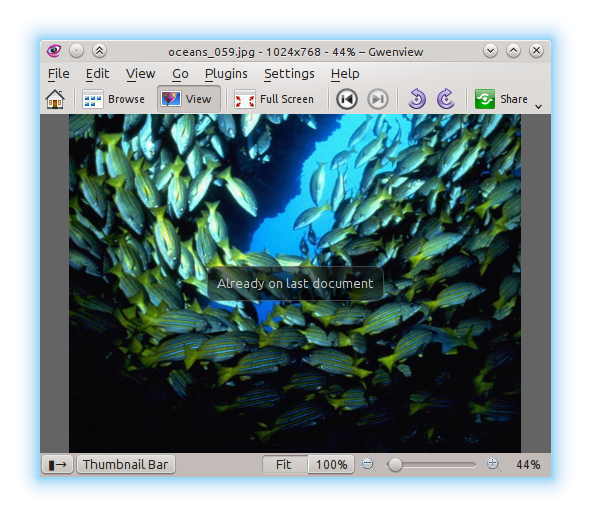

pub_date: 2014-01-22 15:58:17 +01:00
public: true
tags: [kde, gwenview]
title: "Going past the last image (or not)"
summary: |
    A new approach to Gwenview behavior when trying to go past the last image

If you have used Gwenview before KDE SC 4.11 you might be familiar with the following situation: you are running Gwenview in fullscreen mode, pressing Space to go through a folder full of images. At one point, pressing Space does not do anything anymore... What's wrong? A quick move of the mouse to bring up the fullscreen bar reveals that you are on the last image.

## A first solution

This would happen to me quite often, so during KDE SC 4.11 development period I decided to do something about it.

I initially wanted to show an on-screen notification to the user when trying to go past the last image, but it turned out to be complicated to do. If you are familiar with Qt development, you know behaviors such as going to the next image are centralized using [QAction][]. You define the `QAction` once and then plug it in the menubar and toolbar. The `QACtion` also lets you define a keyboard shortcut. Why is it a problem? Because when you reach the last image, the action to go to the next image (let's call it `goToNext`) is disabled, which means its shortcut (rightfully) does not trigger anything, making it impossible to be notified of user attempts to go past the last image.

In 4.11 I settled for an alternative: the `goToNext` action would always be enabled, triggering it while on the last image would go to the first image and show an on-screen notification to let the user know he was now looking at the first image.

[QAction]: http://qt-project.org/doc/qt-4.8/qaction.html

## Not satisfied

After using this setup for a while, I was not satisfied with it: I realized I never want to go back to the first image, I just want to know I reached the end. Still it was nevertheless better than not getting any feedback at all, so I let it in. [A post on Gwenview forum][forum] made me think about that again. The behavior change of the previous and next action broke user "bob p" workflow because the next and previous buttons were now always enabled.

[forum]: http://forum.kde.org/viewtopic.php?f=213&t=119049&sid=33378e23896c33c38a95679b43519b4b

So I set out to look at that annoyance again, and finally figured out a (hackish) way to get notified of shortcut presses when an action is disabled. This makes it possible to keep the `goToNext` action disabled while showing an on-screen notification to let the user know he reached the end of the image list.

## The nitty-gritty details

To implement this I created a class named `DisabledActionShortcutMonitor`. This class monitors an action changes through an event filter. When the action is disabled, its shortcut is assigned to a [QShortcut][]. When the action is enabled, the `QShortcut` shortcut is reset. It's not pretty, but it does the work.

disabledactionshortcutmonitor.h looks like this:

.. sourcecode:: c++

    class DisabledActionShortcutMonitor : public QObject
    {
        Q_OBJECT
    public:
        /**
         * parent must be a widget because we need to create a QShortcut on it
         */
        DisabledActionShortcutMonitor(QAction* action, QWidget* parent);
        ~DisabledActionShortcutMonitor();

    Q_SIGNALS:
        void activated();

    protected:
        bool eventFilter(QObject* object, QEvent* event);

    private:
        QShortcut* mShortcut;
    };

And here is disabledactionshortcutmonitor.cpp:

.. sourcecode:: c++

    DisabledActionShortcutMonitor::DisabledActionShortcutMonitor(QAction* action, QWidget* parent)
    : QObject(parent)
    {
        mShortcut = new QShortcut(parent);
        connect(mShortcut, SIGNAL(activated()), SIGNAL(activated()));
        action->installEventFilter(this);
    }

    DisabledActionShortcutMonitor::~DisabledActionShortcutMonitor()
    {
        delete mShortcut;
    }

    bool DisabledActionShortcutMonitor::eventFilter(QObject* object, QEvent* event)
    {
        if (event->type() == QEvent::ActionChanged) {
            QAction* action = static_cast<QAction*>(object);
            if (action->isEnabled()) {
                // Unset the shortcut otherwise we get a dialog complaining about
                // ambiguous shortcuts when the user tries to trigger the action
                mShortcut->setKey(QKeySequence());
            } else {
                mShortcut->setKey(action->shortcut());
            }
        }
        return false;
    }

You use it like this:

    QAction* myAction = /*...*/;
    // ...
    DisabledActionShortcutMonitor* monitor = new DisabledActionShortcutMonitor(myAction, QApplication::activeWindow());
    connect(monitor, SIGNAL(activated()), SLOT(doSomething()));

`doSomething()` will be called whenever the user uses `myAction` shortcut while `myAction` is disabled.

That's it, I hope it helps you if you are in this peculiar situation. Comments on how to improve the current implementation are welcome.

PS: Code for this feature is currently in [a review request on Gwenview reviewboard][review]. If you are a KDE developer with a few minutes to spare, why not have a look at it?

[QShortcut]: http://qt-project.org/doc/qt-4.8/qshortcut.html
[review]: https://git.reviewboard.kde.org/r/115020/
