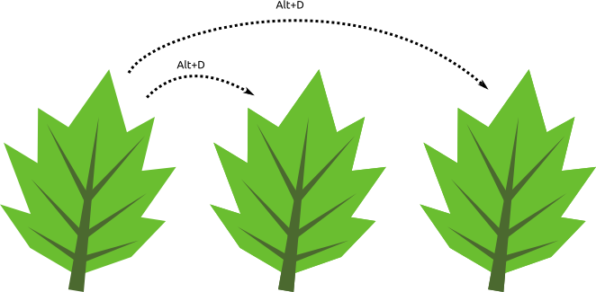
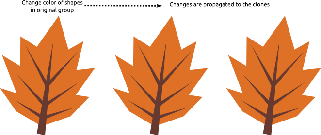
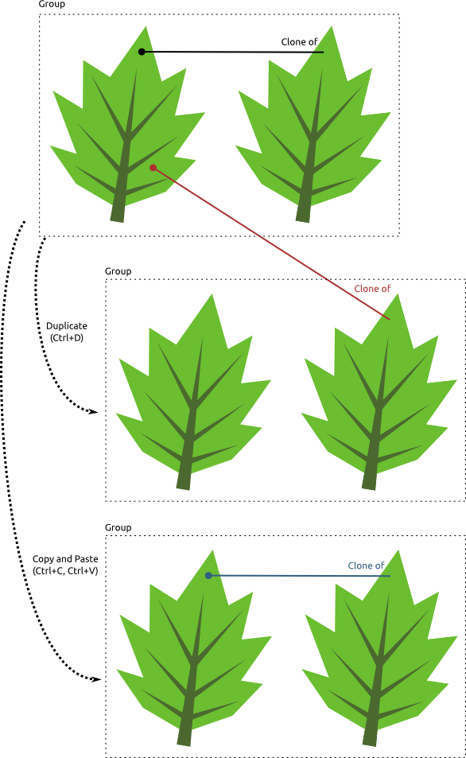

title: "Subtle difference between Duplicate and Copy'n'Paste"
public: true
pub_date: 2014-12-19 21:57:05 +01:00
tags: [Greeenyetilab, Inkscape]
summary: Things to know when duplicating Inkscape clones

I use Inkscape a lot, and for a long time I got puzzled by a strange behavior of duplicated clones. But first a short introduction of the features (feel free to skip if you are familiar with them):

## Clones

Clones are a super handy way to repeat a shape or a group of shapes multiple times. A clone is an exact replica of a shape or a group of shapes: you can create several clones of a polygon and move them at different places, resize and rotate them. Whenever you want to change the polygon, you select the original (or select a clone and press Shift+D to go to the original) and modify it, all clones will be modified the same way.

Here is a quick example. Let's start with a simple leaf:

Now clone it:

Edit the original, the changes are propagated:

## Duplicate

Sometimes you want real copies though, not clones. To create real copies  you can either use the good old Copy (Ctrl+C) and Paste (Ctrl+V) combination, but you can also use Duplicate instead: a simple press of Ctrl+D will create a copy of the selection. It is often suggested to use Ctrl+D as it is one less keystroke than Ctrl+C then Ctrl+V.

## The Subtle Difference

I thought for a long time that Duplicate was just a faster way to do Copy then Paste, but it turns out they behave differently. If you duplicate cloned shapes within a group using Duplicate, the new clones point to the original shape in the original group. If you use Copy and Paste instead, the new clones point to the copy of the original in the copied group. Confused? Hopefully this example will make it clearer:

## Is It Really That Annoying?

I don't know about you, but I like to keep various versions of a drawing or parts of a drawing as I experiment with changes. In the past I used Duplicate to keep older versions around but the clones were messed up. Nowadays I create those "backup" versions with Copy and Paste. I am not sure if this is a bug or a feature: I can see how it could be handy to make sure all clones still point to a single original, but this behavior was surprising to me.
