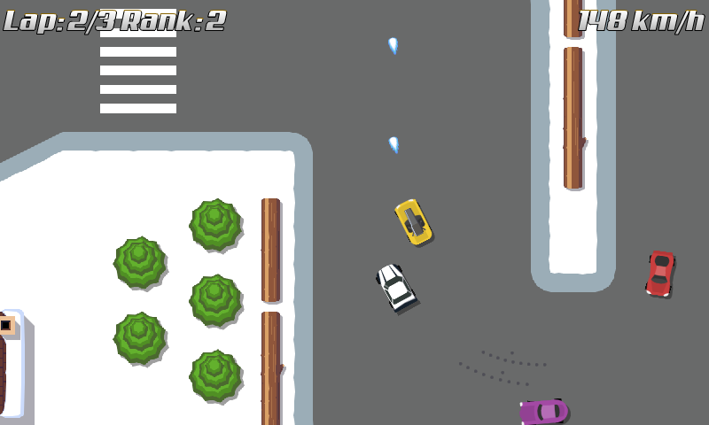

title: "Bonuses!"
public: true
pub_date: 2015-04-06 22:53:30 +01:00
tags: [Greeenyetilab, Race, Bonus]
summary:

The bonus system is taking shape: racers can now pick them up and get one among the huge bonus list of gun, gun or gun... :) Not much choice for now because I was waiting for the code responsible for handling bonuses to stabilize before I build more on top of it. I think it's in a good enough shape now to start building more bonuses.

AI competitors can also pick bonuses, but Artificial Stupidness would be a more appropriate term to describe their current behavior: they trigger the bonus as soon as they pick it up :). Another interesting aspect to work on later.

I have been struggling with the difficulty of the game: it was too easy to end up straight in front of a wall. I mitigated this by reducing the restitution of the walls and of the cars. It is more playable now, but I am still wondering whether I should allow cars to rotate in place when speed is close to 0. This would make it easier to get unstuck. I noticed a few games do this.

## Test build

Want to give it a try? I built a .apk for you to test:

<a href="/storage/race/race-150407-1.apk" class="dl-button">race-150407-1.apk</a>

This build comes with a quite large debug screen accessible from the settings screen. Feel free to play with the settings and let me know if you come up with some interesting combinations!

## What's next?

My next topic is going to be damages. I want to change the way damages are handled: instead of a system of health points where you can take a few hits before dying permanently I want hits to disrupt your path, probably with a spin... Yes, similar to Mario Kart, again. I also plan to build more bonuses, and I hope to depart from Mario Kart here.
