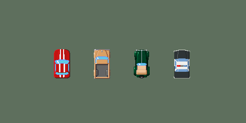

title: "Going Retro"
public: true
pub_date: 2015-05-21 09:41:49 +01:00
tags: [Greenyetilab, tinywheels]
summary: Deciding for a pixel art look for Tiny Wheels.

I have been experimenting lately with a different art style for Tiny Wheels. Since the gameplay itself is quite old school, I decided to try pixel art graphics.

There has been a bit of noise lately regarding whether using pixel art in new games was a good idea after [this article got published][1]. I decided to go this way nevertheless for few reasons:

- As I said, the gameplay itself should appeal to persons who played old 2D games like [Micro Machines][mm], [Nitro][] or [Super Cars][], therefore I believe the target audience will not be put off by the big pixels.

[mm]: http://www.mobygames.com/game/micro-machines
[Nitro]: http://www.mobygames.com/game/nitro
[Super Cars]: http://www.mobygames.com/game/amiga/supercars

- Paradoxically, it is easier for me to support multiple resolutions with pixel art: zoom the images, make sure no smoothing algorithm is used, done!

- I initially used vector drawing with the idea of supporting multiple resolutions, but in practice one still need to align vectors to pixels to product sharp results and render the drawings in multiple resolutions. That is not fun and quite time consuming for a single art-developer like me.

- There are also a few benefits from a developer point of view: images are smaller so texture atlases are more likely to contain all of them, which is more efficient for OpenGL rendering. Additionally, since there is no need to provide multiple versions of the images for different device resolutions, the game packages are going to be smaller.

As I was leaving my beloved Inkscape behind, I shopped around for Linux software to use to produce my blocky vehicles. I played a bit with GIMP, a bit more with Krita (which I really wanted to use, but it's not really designed for pixel art) and finally settled on [Aseprite][] for now. It's definitely made for pixel art, and makes it easy to create animations thanks to its onion skin feature.

Here is a preview of what I have produced so far:

[1]: http://www.dinofarmgames.com/a-pixel-artist-renounces-pixel-art/
[Aseprite]: http://aseprite.org
