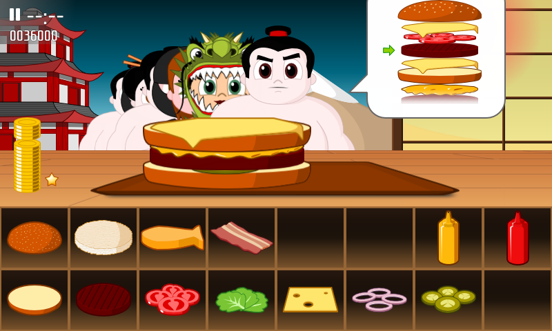

title: "Guess who's coming to dinner"
public: true
pub_date: 2015-01-05 10:22:25 +01:00
tags: [Greeenyetilab, burgerparty]
summary: A new customer for the Japan world of Burger Party.

In the current version of Burger Party, the "boss" customer of the Japanese world is a [girl wearing a dragon costume](/2014/back-to-work). I was not happy with it though: after I was done drawing it, it ended up not looking big enough to be a suitable boss, especially the boss of the last world.

During this holiday I started sketching a more imposing replacement. Since this is Japan, I picked a Sumo wrestler:

And here it is in action, looking a bit annoyed because I am taking too long to prepare his burger:

As you can see on the screenshot, the dragon girl has not disappeared: she has just been "downgraded" to a regular customer, so you will see her more often when playing the Japan world. This is a good thing if you ask me, because it took me a long time to draw her!

The sumo will be in the next update, which is planned for this month.
