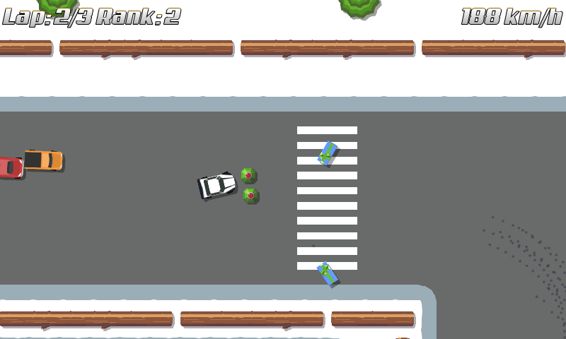

title: "Mines are back!"
public: true
pub_date: 2015-04-26 19:53:18 +01:00
tags: [Greeenyetilab, Race]
summary: New release brings back mines and comes with a desktop version!

Time for a new Race release! What's new in this one?

First, mines are back! They work a bit like bananas in Mario Kart now: they stay behind you until you drop them with the action button. Even when the mine is behind you, you can hit opponents with it, which is quite fun.

_This is going to hurt..._

Speaking of weapons, AI racers got a bit smarter with the gun: they now only shoot if there is another racer in front of them.

Permanent death is gone: When you get hit, your car spin but you don't loose health and can continue racing.

Less racers: I reduced the number of racers from 8 to 6 so that races feel a bit less crowded.

More forgiving road borders: previously when one of your wheels left the road, some drag was applied to it, but not to the other wheels, causing your car to steer further out of the road. That is quite logical, but it was frustrating so I changed this: now when your car starts to get out of the road, a drag is applied to the whole vehicle, slowing you down but leaving your direction unaltered.

Finally a big one: a desktop version! I built a simple archive containing the .jar file for the game and a shell script to start it. It requires a Java Runtime Environment (JRE) for now. For real releases I will build self-contained archives, but that creates much larger binaries, so I'd rather require an installed JRE for now.

I only tested it on Linux for now (works fine with [OpenJDK 7][openjdk]), it may or may not work on Windows and Mac OS. If you are a Windows or a Mac user, let me know how it goes.

<a href="/storage/race/race-150426-2250.apk" class="dl-button">race-150426-2250.apk</a>
<a href="/storage/race/race-150426-2250.tar.bz2" class="dl-button">race-150426-2250.tar.bz2</a>

[openjdk]: http://openjdk.java.net/
