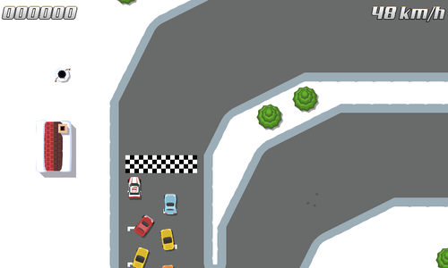
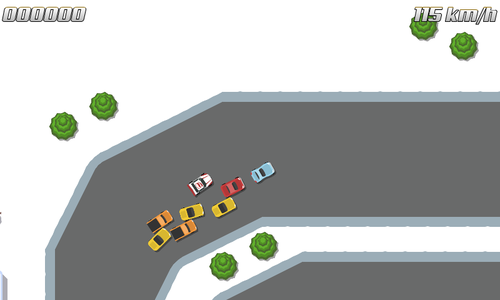

title: "More Racing Experiments"
public: true
pub_date: 2015-02-12 23:29:21 +01:00
tags: [greenyetilab, race]
summary: Turning my endless-runner car game prototype into a proper racing game.

I have been doing more experiments these days with my car game project. I decided to try out how it would feel to turn it into a "real" racing game with laps and positions rather than an endless runner.

I put together a simple race track and got the AI cars to follow a predefined set of waypoints. I originally thought it would be very easy to notice how all AI cars follow the same path, but it turned out to be not so apparent. They are still quite dumb though: they happily ignore the other cars and don't know they should reverse when they get stuck (which happen rather often due to them ignoring the other cars), I need to teach them a few tricks. It's quite fun nevertheless though: sometimes I find myself chasing the AI cars for a bit longer than would be necessary for testing: not good for making the best of my limited time, but still a good sign :)

The car can still shoot endlessly right now, but I am leaning toward a Mario-Kart gameplay, so endless shooting ability is going to be replaced with one-shot bonuses.

Here are a few screenshots. First one, just after the beginning of the race:

Race has started:

A bunch of AI cars got stuck. Told you they are stupid :)

Death Rally style!

