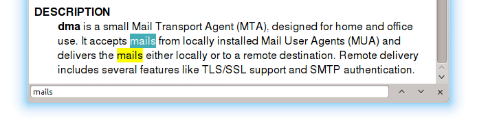
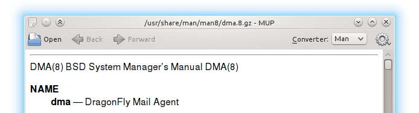

pub_date: 2015-05-06 22:30:51 +02:00
public: true
tags: [mup]
title: "Some News From MUP"
summary: |
    A quick update of the changes which have been made in MUP since the last time I wrote about it.

Time for a quick update on [MUP, the markup previewer][mup]. Since I last wrote about it, it gained a few features: it was already capable of displaying man pages, but I added a simple wrapper to be able to open man pages just like the regular `man` command. You can now run `mupman grep` to learn all about `grep`.

Interestingly, I initially added support for man pages as a way to add yet another markup to MUP, and these days man pages is what I read most often with MUP, to the point where I created a `mm` shortcut to start it faster :)

[mup]: http://github.com/agateau/mup

## Search bar

This prompted for another feature. Pressing "Ctrl+F" or "/" brings a simple and unobtrusive search bar at the bottom of the window:

## Fork

Another change I made is to have MUP fork by default, no longer blocking the caller. I find this handy when I open a README or a man page as I can use a command while reading its documentation. It is also useful when editing a text in Vim: just type `:!mup %` to start MUP on the current file. One less character from the previous `:!mup % &`, massive productivity improvement!

## More converters!

Finally, I added two new Markdown converters, because you can never have enough Markdown converters. These converters are a bit unusual: they use GitHub API. This means your text is sent over to GitHub and comes back as HTML. They are obviously slower than the other converters, but they are useful if you want to be sure your README.md will looks as you expect on your project landing page, without having to do multiple commits and pushes to get it right.

You might wonder why I say *two* converters. It's because GitHub actually supports two flavors of Markdown: plain Markdown is used for READMEs, while GFM - GitHub Flavored Markdown - is used in issues and in other places. The difference between the two is that GFM takes line breaks into account.

I might actually drop the GFM converter at some point, it feels less useful than the plain Markdown one. We'll see.

## User interface refresh

The toolbar got reworked as well: it now comes with back and forward buttons, and a menu button in the right corner to hide some less important actions such as Reload or Open with Editor.

Implementing the history for the back and forward buttons was a bit tricky to get right. I tried to use QWebHistory but could not find a way to use it because MUP generates the HTML code to display (as opposed to pointing the QWebView to existing files), so I had to roll my own implementation. If you know how to use QWebHistory in this context, I'd be happy to hear from you.

## What's next?

I am considering modernizing the application a bit. First migrating it to Python 3, then to Qt 5, we'll see how it goes.

