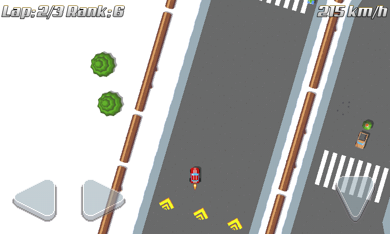

title: "Tiny Wheels 0.2"
public: true
pub_date: 2015-08-11 08:07:06 +01:00
tags: [Greenyetilab, pixelwheels]
summary: "A new release of Tiny Wheels, featuring a new bonus: the turbo and several gameplay and user interface improvements!"

I have been busy these days fighting some stupid illness, but I am fixed now. I worked a bit on Tiny Wheels nevertheless, so it's time to release a new version. Here are some of the changes of 0.2:

## User interface changes

I reworked the touch screen interface: buttons have a more pixel-art look, with a different appearance when pressed. More importantly, they are bigger and their size adjust to the device physical size, so they should always be roughly 1.5 cm per 1.5 cm wide no matter the device. I feel it works better this way, let me know what you think.

The various screens you go through before starting the game now scale to the device size, so you don't get super tiny buttons on high density devices. The user interface looks a bit ugly right now because scaling is not smooth due to the game not using any scaling filter to achieve a pixel art look. Need to work on this to ensure it looks pixel-art-like, but not ugly. 

I also dropped the accelerometer and swipe input methods for now, they were unmaintained and not usable. I am probably going to bring back at least accelerometer input in the future.

## Gameplay changes

Turbo is done, at least a first version of it. That brings the number of different bonuses to 3, woohoo! :)

Bonuses are now attributed according to your current rank in the game: if you are in the top pack you will get mines, if you are in the middle, you are more likely to get guns or turbos, if you are at the end you will get mostly turbos. That makes it a bit easier to catch up when you made a driving mistake.

The game was still too hard, so I made it a bit slower. Once again, your feedback is welcome, as it is hard to judge the difficulty since I play it a lot.

Finally, AI racers changed their behavior with regard to mines: the AI used to drop the mine as soon as it picked it, now they wait for a few seconds before dropping it (they still don't care if someone is behind or not). This new behavior makes it less frustrating when you are close to an AI racer and it picks up a bonus mine: you now have a short time to move away from its back before the mine is dropped.

That's it for this release, hope you like it. As usual, it's available for [PCs and Android devices](/projects/tinywheels).
