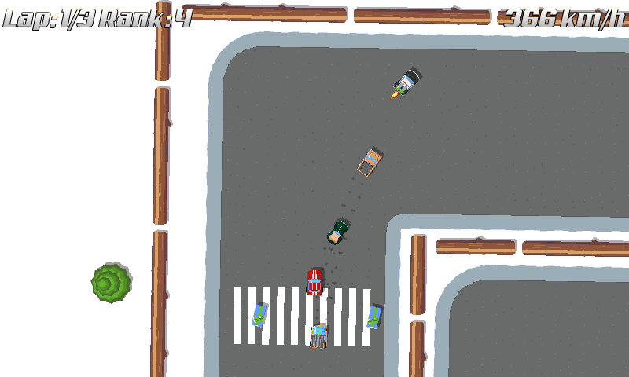
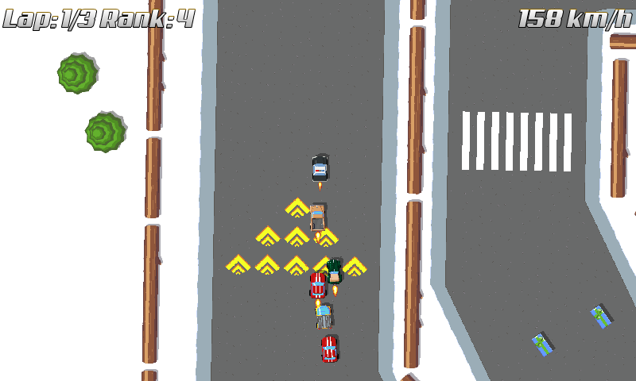

title: "Turbo!"
public: true
pub_date: 2015-07-25 19:05:22 +01:00
tags: [Greeenyetilab, tinywheels]
summary: "Working on a new bonus for Tiny Wheels: the turbo."

This week I have been working on a new bonus for Tiny Wheels: the turbo. When you pick it up, two bottles of green liquid get strapped on top of your vehicle (Some N2O probably. Is N2O green? I have no idea). Triggering it gives you a significant boost, and a small flame appears behind you, because you are driving faaaast!

I am still working on it, but it's almost done. I also reworked the turbo road tiles to use the same code, as the turbo bonus gives you better control on your vehicle than the road tiles used to.

_Police car using a turbo bonus:_

_Racers driving over turbo road tiles:_

