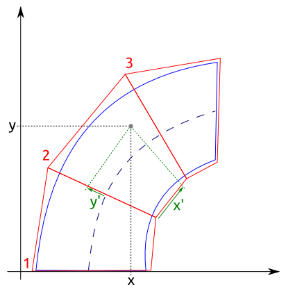
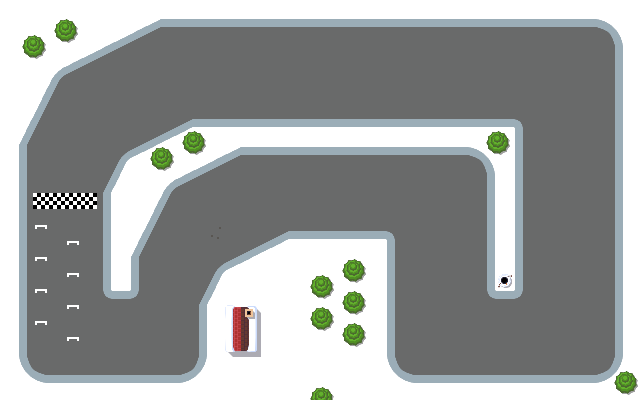
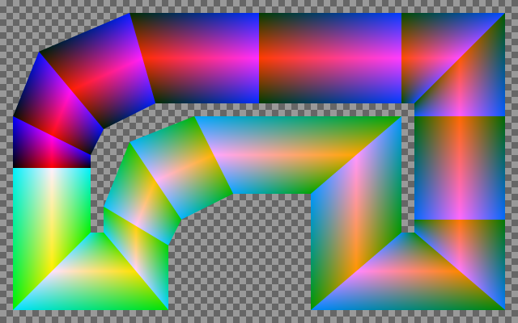
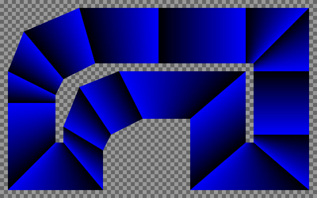
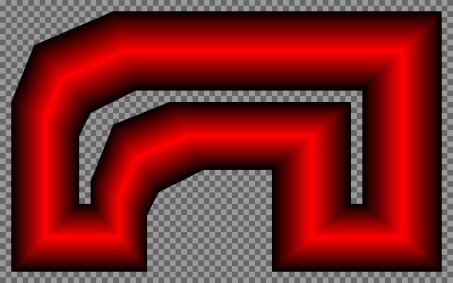
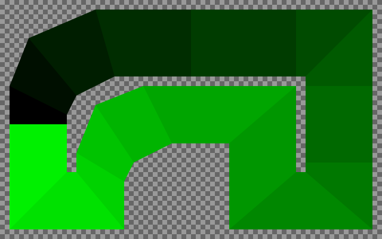

title: "Who's first?"
public: true
pub_date: 2015-03-12 09:09:06 +01:00
tags: [greenyetilab, race, gamedev]
summary: Determining who is currently leading the race is trickier than it sounds. Here is how I implemented it.

I have been struggling for quite some time on a seemingly simple feature in Race: how to compute the position of the vehicles within the lap, ie: is a vehicle at the beginning of a lap, in the middle, or is it 80% done? And related to this, how close is it from the track borders? This is useful in many cases: to determine the player rank, to know if a lap has been completed (without cheating...) or to let the AI take decisions.

I did quite a lot of research on the topic until I found this [great article][moto-gp-article] from one of the MotoGP developers. I implemented something similar by splitting the track into convex quadrilateral sections. The goal of these sections is to map the vehicle (x, y) coordinates into a "track" coordinate system where the first coordinate is the distance within the lap (distanceInLap) and the second coordinate is the distance from the track center (distanceFromTrackCenter).

[moto-gp-article]: http://blogs.msdn.com/b/shawnhar/archive/2009/12/30/motogp-ai-coordinate-systems.aspx

The following diagram illustrates this:

- Sections are in red
- x' is the distance within the section
- y' is distanceFromTrackCenter
- distanceInLap can be computed as the section number + x' (assuming x' goes from 0 to 1)

Determining the current section number is easy: my code iterates on all the quadrilaterals until it finds one which contains (x, y) (If this turns out to be too slow, I will store the quadrilaterals in a spatial-aware container). Next I needed to map (x, y) to (x', y'). More research and head scratching brought a solution based on an [homographic transform][].

[homographic transform]: http://alumni.media.mit.edu/~cwren/interpolator/

For debugging purposes, I created a tool which draws the sections in an image, using red for y', green for sectionNumber and blue for x'.

Given this track:

You get this fancy output:

Looking at each channel individually is actually more useful.

Here is x':

y':

and the sectionNumber:

The quadrilaterals are currently defined as polygons in [Tiled][], but it's a bit error prone as one must take care of defining the vertices in the right order and ensure the vertices of adjacent quadrilaterals are at the same place. I plan to change this to use segments going from (0, -1) to (0, 1) and (1, -1) to (1, 1). This would make it possible to share vertices (the y'=1 segment of section N would be the y'=0 segment of section N+1). I also plan to define track borders from those segments instead of using yet another Tiled object layer as I do for now.

All those changes will be for later though, right now the next feature I plan to work on is the bonus system, hopefully bringing some Mario-kart-like fun into the game.

[Tiled]: http://www.mapeditor.org
