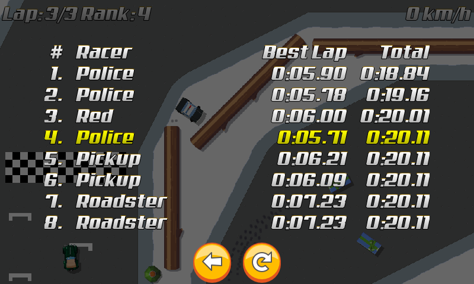

title: "Who's the Fastest?"
public: true
pub_date: 2015-05-27 19:10:49 +01:00
tags: [greenyetilab, pixelwheels, gamedev]
summary: Which racer drove the fastest?

Over the weekend I added code to show racer times. Both total race time and best lap time are measured and displayed at the end of the race. They are not recorded anywhere for now, still pondering if they should.

The more observant among you may have noticed something odd: the race time of racers who finished after the player are all the same... That is a bug I need to fix: right now as soon as the player has finished the race the simulation ends and thus the race time of other racers is the same as the player race time. I need to let the simulation run to get all times, which also means I need to teach AI racers to unstuck themselves from road borders, otherwise they will never finish :)

Speaking of bugs, I created a [Tiny Wheels project][twgh] on GitHub. There is no code for now (Though I may release the source some time after the game has been released), I am going to use GitHub issues to track Tiny Wheels bugs. This time bug is [bug #11][b11].

[twgh]: http://github.com/agateau/tinywheels
[b11]: http://github.com/agateau/tinywheels/issues/11
