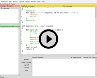
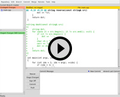

pub_date: 2016-01-31 07:54:20 +01:00
public: true
tags: [Git, Tips]
title: An intro to git gui
summary: |
    A presentation of git gui, and why you should use it

I have been using git for years now, I think I can say I know the tool quite well, yet I do all my commits with `git gui`. This often surprises my coworkers because a) it looks a bit ugly and b) it's a graphical application! The horror!

This is what it looks like:

.. thumbimg :: git-gui-screenshot.png
    :alt: git gui screenshot

Yes, it's indeed a bit ugly, thanks to it using tcl-tk, just like its most widely known brother, `gitk`.

On the left side you can see two lists: the top list contains all your unstaged changes, the bottom list contains all your staged changes (ie: files which have been added with `git add`, or removed with `git rm`).

The right side, contains a large view which shows the change of the currently selected file and in the bottom a text area where you can enter your commit message as well as a few widgets to trigger different actions.

How does one uses it? Easy: to stage a file to commit click on the icon of the file in the top-left side: the file disappears from the top list and appears in the bottom one. If you click on the name of the file, it gets selected, and you can see the changes in the main area.

## Why use `git gui` instead of the command line?

For a few reasons: first it provides an easy way to review your commits before they get in. I have often caught a debug line I forgot to remove or some added trailing spaces while going through my changes this way.

Second, and most importantly, it is much easier to do partial commits with `git gui`. Partial commits, if you are not familiar with this, is the ability to commit only parts of a file. This (slightly controversial) feature is useful to clean up a commit or to break a set of unrelated changes in separate commits. Often necessary when I land back on Earth after a frenzy coding session. It's also useful to split commits when doing an interactive rebase.

The command-line way to do so is `git add -p`, but that is really tedious because it shows one hunk at a time, you don't have a global view of all the changes. With `git gui` you can just scroll the diff, just right-click on a change and select "Stage Hunk For Commit". If you change your mind, select the file in the Staged list, right click the staged hunk and select "Unstage Hunk From Commit".

It's even better when you want to do finer grained commits and stage only lines: with `git add -p` you have to edit diffs. That is really not efficient and very error prone. This is where `git gui` really shines: select the lines you want to commit (either additions or removals), right click and select "Stage Lines For Commit". Done.

In this little animation I create two commits from my current changes:

It works the other way as well: stage all the file or a few hunks, then right click on that debug line or that extra blank line and select "Unstage Line From Commit".

Here I remove a debug line after staging all changes:

## "But it's a graphical application, it can't be as fast as the command line!"

It turns out that, at least for me, `git gui` is fast enough. It starts up instantly and has a set of shortcuts which makes it possible to do many operations without using the mouse. Here is the list of shortcuts I use most often:

- Ctrl+T/Ctrl+U: Stage/unstage selected file
- Ctrl+I: Stage all files (asks if you want to add new files if there are any)
- Ctrl+J: Revert changes
- Ctrl+Enter: Commit
- Ctrl+P: Push

## What about other frontends?

I must confess I haven't tried a lot of other frontends. I played a bit with `git cola` a few years ago but I did not feel as productive as with `git gui`. There are probably nicer alternatives out there but one of the main advantages of `git gui` is that it is an official part of Git, so it is available wherever Git is available, I have used `git gui` on Windows and Mac OS X: it works just like on Linux.
