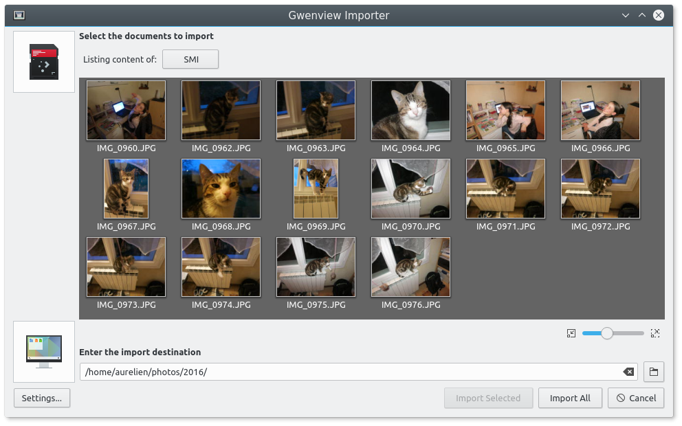

pub_date: 2016-11-24 07:50:27 +01:00
public: true
tags: [gwenview, kde, kf5]
title: Gwenview Importer is back
summary: |
    Ported Gwenview Importer to KDE Frameworks 5.

I spent some time over the last weeks to port Gwenview Importer to KDE Frameworks 5, as I was getting frustrated with importing pictures by hand. It's a straight port: no new features.

Here is a screenshot after I filled my SD Card with random pictures of my daughter and cat for the purpose of illustrating this blog post :)

I missed the KDE Applications 16.12 deadline, but the code is in Gwenview master now, so Gwenview Importer should be in the next KDE Applications release.

---

*Update, 2017-05-14:*

Looks like I messed up while porting, see [bug 379615][bug]. Users of 17.04.0 and 17.04.1 should refrain from using the importer. Thanks to Henrik (don't know your last name, sorry), the bug has been fixed in 17.04.2.

[bug]: https://bugs.kde.org/show_bug.cgi?id=379615
