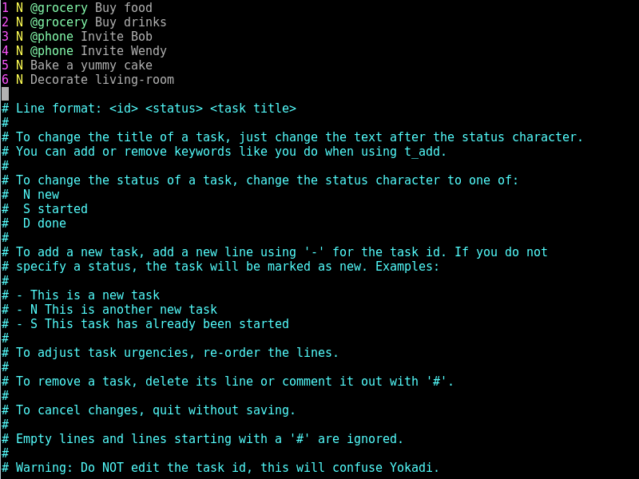

pub_date: 2016-05-28 00:02:40 +01:00
public: true
tags: [Yokadi]
title: Mass edit your tasks with t_medit
summary: |
    t_medit, a new command for Yokadi to quickly edit multiple tasks.

If you are a Yokadi user or if you have used other todo list systems, you might have encountered this situation where you wanted to quickly add a set of tasks to a project. Using Yokadi you would repeatedly write `t_add <project> <task title>`. History and auto-completion on command and project names makes entering tasks faster, but it is still slower than the good old TODO file where you just write down one task per line.

`t_medit` is a command to get the best of both worlds. It takes the name of a project as an argument and starts the default editor with a text file containing a line for each task of the project.

Suppose you have a "birthday" project like this:

    yokadi> t_list birthday
                                 birthday
    ID|Title               |U  |S|Age     |Due date
    -----------------------------------------------------------------
    1 |Buy food (grocery)  |0  |N|2m      |
    2 |Buy drinks (grocery)|0  |N|2m      |
    3 |Invite Bob (phone)  |0  |N|2m      |
    4 |Invite Wendy (phone)|0  |N|2m      |
    5 |Bake a yummy cake   |0  |N|2m      |
    6 |Decorate living-room|0  |N|2m      |

Running `t_medit birthday` will start your editor with this content:

    1 N @grocery Buy food
    2 N @grocery Buy drinks
    3 N @phone Invite Bob
    4 N @phone Invite Wendy
    5 N Bake a yummy cake
    6 N Decorate living-room

By editing this file you can do a lot of things:

- Change task titles, including adding or removing keywords
- Change task status by changing the character in the second column to `S` (started) or `D` (done)
- Remove tasks by removing their lines
- Reorder tasks by reordering lines, this will change the task urgency so that they are listed in the defined order
- Add new tasks by entering them prefixed with `-`

Let's say you modify the text like this:

    2 N @grocery Buy drinks
    1 N @grocery Buy food
    3 D @phone Invite Bob
    4 N @phone Invite Wendy & David
    - @phone Invite Charly
    5 N Bake a yummy cake
    - S Decorate table
    - Decorate walls

Then Yokadi will:

- Give the "Buy drinks" task a more important urgency because it moved to the first line
- Mark the "Invite Bob" task as done because its status changed from `N` to `D`
- Change the title of task 4 to "@phone Invite Wendy & David"
- Add a new task titled: "@phone Invite Charly"
- Remove task 6 "Decorate living-room"
- Add a started task titled: "Decorate table" (note the `S` after `-`)
- Add a new task titled: "Decorate walls"

You can even quickly create a project, for example if you want to plan your holidays you can type `t_medit holidays`. This creates the "holidays" project and open an empty editor. Just type new tasks, one per line, prefixed with `-`. When you save and quit, Yokadi creates the tasks you entered.

One last bonus: if you use Vim, Yokadi ships with a syntax highlight file for `t_medit`:

This should be in the upcoming 1.1.0 version, which I plan to release soon. If you want to play with it earlier, you can grab the code from the [git repository][gh]. Hope you like it!

[gh]: https://github.com/agateau/yokadi
