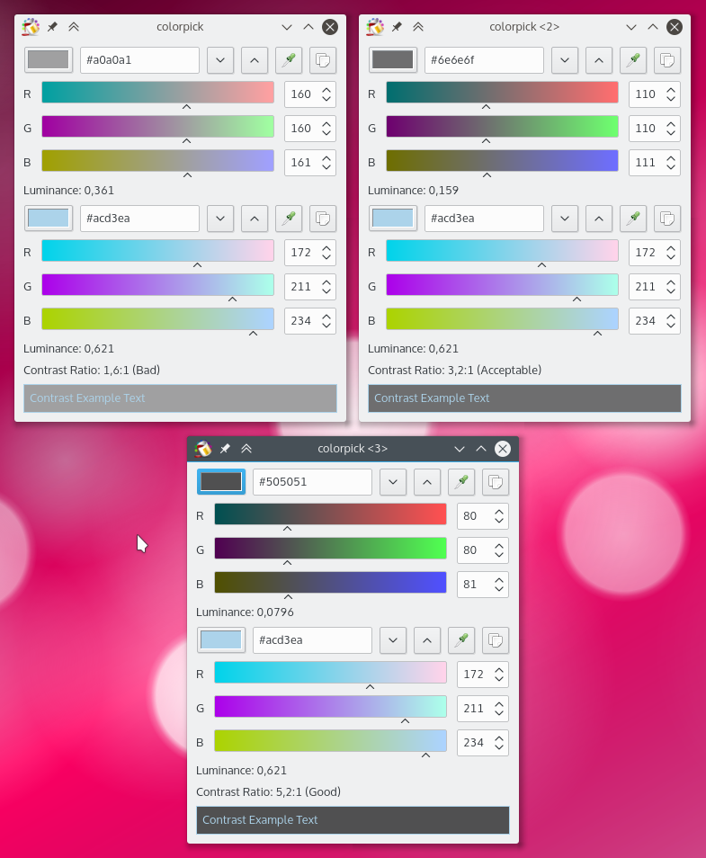
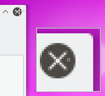

pub_date: 2016-08-26 20:07:28 +01:00
public: true
tags: [Qt, Colorpick]
title: Qt 5 based Colorpick
summary: |
    Colorpick has been ported to Qt 5.

[Colorpick][] is one of my little side-projects. It is a tool to select colors. It comes with a screen color picker and the ability to check two colors contrast well enough to be used as foreground and background colors of a text.

*Three instances of Colorpick showing how the background color can be adjusted to reach a readable text.*

*The color picker in action. The cursor can be moved using either the mouse or the arrow keys.*

I wrote this tool a few years ago, using Python 2, PyQt 4 and PyKDE 4. It was time for an update. I started by porting it to Python 3, only to find out that apparently there are no Python bindings for KDE Frameworks...

Colorpick uses a few kdelibs widgets, and some color utilities. I could probably have rewrote those in PyQt 5, but I was looking for a pretext to have a C++ based side-project again, so instead I rewrote it in C++, using Qt5 and a couple of KF5 libraries. The code base is small and PyQt code is often very similar to C++ Qt code so it only took a few 45 mn train commutes to get it ported.

If you are a Colorpick user and were sad to see it still using Qt 4, or if you are looking for a color picker, [give it a try][Colorpick]!

[Colorpick]: https://github.com/agateau/colorpick
