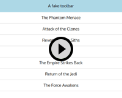
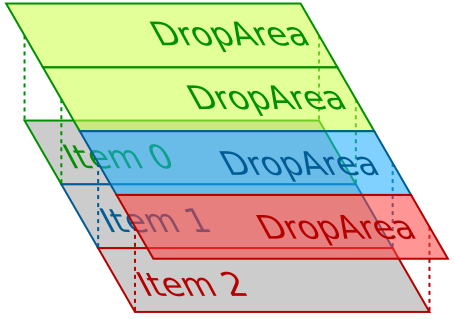

pub_date: 2016-04-24 17:28:45 +01:00
public: true
tags: [qt, qml, drag'n'drop]
title: Reordering a Qt Quick ListView via drag'n'drop - part 1
summary: |
    How to setup a Qt Quick ListView so that the user can reorder its elements by dragging them around.

It is common in user interfaces to provide the user with a list of elements which can be reordered by dragging them around. Displaying a list of elements with Qt Quick is easy, thanks to the ListView component. Giving the user the ability to reorder them is less straightforward. This 3 article series presents one way to implement this.

The goal of this first article is to create a list which can be used like this:

## Architecture

The approach I used was to do all the work in a DraggableItem, leaving the ListView untouched. DraggableItem is used as the delegate of the ListView, and wraps the real QML item responsible for showing the details of the list element.

Lets start with `main.qml`. Nothing fancy at the beginning, we create a Window and a ListModel defining our elements:

.. sourcecode:: qml

    import QtQuick 2.6
    import QtQuick.Window 2.2
    import QtQuick.Controls 1.4
    import QtQuick.Layouts 1.1

    Window {
        visible: true
        width: 500
        height: 400

        ListModel {
            id: myModel
            ListElement {
                text: "The Phantom Menace"
            }
            ListElement {
                text: "Attack of the Clones"
            }
            ListElement {
                text: "Revenge of the Siths"
            }
            ListElement {
                text: "A New Hope"
            }
            ListElement {
                text: "The Empire Strikes Back"
            }
            ListElement {
                text: "Return of the Jedi"
            }
            ListElement {
                text: "The Force Awakens"
            }
        }

Now comes the main Item. It contains a ColumnLayout which holds a Rectangle faking a toolbar and our ListView, wrapped in a ScrollView:

.. sourcecode:: qml

    Item {
        id: mainContent
        anchors.fill: parent
        ColumnLayout {
            anchors.fill: parent
            spacing: 0

            Rectangle {
                color: "lightblue"
                height: 50
                Layout.fillWidth: true

                Text {
                    anchors.centerIn: parent
                    text: "A fake toolbar"
                }
            }

            ScrollView {
                Layout.fillWidth: true
                Layout.fillHeight: true
                ListView {
                    id: listView
                    model: myModel
                    delegate: DraggableItem {
                        Rectangle {
                            height: textLabel.height * 2
                            width: listView.width
                            color: "white"

                            Text {
                                id: textLabel
                                anchors.centerIn: parent
                                text: model.text
                            }

                            // Bottom line border
                            Rectangle {
                                anchors {
                                    left: parent.left
                                    right: parent.right
                                    bottom: parent.bottom
                                }
                                height: 1
                                color: "lightgrey"
                            }
                        }

                        draggedItemParent: mainContent

                        onMoveItemRequested: {
                            myModel.move(from, to, 1);
                        }
                    }
                }
            }

We can see DraggableItem used as a delegate of the ListView. Its API is simple: it wraps another item which shows the content (here it is a rectangle with a text and a one-pixel border at the bottom). 

DraggableItem has one property: `draggedItemParent`, which defines which item becomes the parent of our content item while it is being dragged around. Setting this to the main content of your window gives a more natural feeling when you drag the item below or above the ListView: the item is not clipped to its view and appears on top of the other UI elements.

It also has a signal: `moveItemRequested`, which is emitted when the user dragged an item from one place to another. In this example we use ListModel.move to react to this but if you use a custom model you could call any other method.

## DraggableItem implementation

DraggableItem contains a `contentItemWrapper` item, which is the parent of the DraggableItem child. When we start dragging, `contentItemWrapper` is reparented to the item specified in the `draggedItemParent` property of DraggableItem.

This is the beginning of DraggableItem.qml, it shows how `contentItem` is wrapped inside `contentItemWrapper`:

.. sourcecode:: qml

    import QtQuick 2.0

    Item {
        id: root

        default property Item contentItem

        // This item will become the parent of the dragged item during the drag operation
        property Item draggedItemParent

        signal moveItemRequested(int from, int to)

        width: contentItem.width
        height: contentItem.height

        // Make contentItem a child of contentItemWrapper
        onContentItemChanged: {
            contentItem.parent = contentItemWrapper;
        }

        Rectangle {
            id: contentItemWrapper
            anchors.fill: parent

Lets finish the definition of `contentItemWrapper` and continue with the code necessary to start the drag:

.. sourcecode:: qml

    //
            Drag.active: dragArea.drag.active
            Drag.hotSpot {
                x: contentItem.width / 2
                y: contentItem.height / 2
            }

            MouseArea {
                id: dragArea
                anchors.fill: parent
                drag.target: parent
                // Keep the dragged item at the same X position. Nice for lists, but not mandatory
                drag.axis: Drag.YAxis
                // Disable smoothed so that the Item pixel from where we started the drag remains
                // under the mouse cursor
                drag.smoothed: false

                onReleased: {
                    if (drag.active) {
                        emitMoveItemRequested();
                    }
                }
            }
        }

        states: [
            State {
                when: dragArea.drag.active
                name: "dragging"

                ParentChange {
                    target: contentItemWrapper
                    parent: draggedItemParent
                }
                PropertyChanges {
                    target: contentItemWrapper
                    opacity: 0.9
                    anchors.fill: undefined
                    width: contentItem.width
                    height: contentItem.height
                }
                PropertyChanges {
                    target: root
                    height: 0
                }
            }
        ]

A few things are worth noting here:

To create a draggable area, we use a MouseArea with the `drag.target` property set to the Item we want to drag.

In `contentItemWrapper`, we set `Drag.active` to `dragArea.drag.active`. If we did not do this, we would still be able to drag our Item, but DropArea would not notice it moving hover them (`DropArea.containsDrag` would remain false). We also define `Drag.hotspot` to the center of the dragged item. The hotspot is the coordinate within the dragged item which is used by DropArea to determine if a dragged item is over them.

When we start dragging, we change to the "dragging" state. In this state  `contentItemWrapper` is reparented to `draggedItemParent` and the DraggableItem height is reduced to 0, completely hiding it.

Unless you associate data to your drag, for example to implement dragging from an application to another, the DropArea won't emit the `dropped` signal. This is why we trigger the move in the handler of the MouseArea `released` signal.

## Dropping

Now that we have the "drag" part, we need to take care of the "drop" part.

Each DraggableItem contains a DropArea which is the same size as the DraggableItem and is positioned between its DraggableItem and the one next to it. This way when the user drops an item on a DropArea, we know we have to insert the dragged item after the item which owns the DropArea.

There is a special case though: we also want the user to be able to drop an item *before* the first item. To handle this, the first DraggableItem of the list is going to be special: it will have another DropArea, with its vertical center aligned to the top edge of the DraggableItem.

This diagram should make it clearer:

As you can see, "Item 0" has two DropArea, whereas the other items only have one. Here is the code which adds the DropAreas:

.. sourcecode:: qml

    Loader {
        id: topDropAreaLoader
        active: model.index === 0
        anchors {
            left: parent.left
            right: parent.right
            bottom: root.verticalCenter
        }
        height: contentItem.height
        sourceComponent: Component {
            DraggableItemDropArea {
                dropIndex: 0
            }
        }
    }

    DraggableItemDropArea {
        anchors {
            left: parent.left
            right: parent.right
            top: root.verticalCenter
        }
        height: contentItem.height
        dropIndex: model.index + 1
    }

We use a Loader to create the special DropArea for the first item of the list. DraggableItemDropArea is just a DropArea with a `dropIndex` property and a Rectangle to show a drop indicator. Before showing its code, lets finish the code of DraggableItem. The only remaining part is the function responsible for emitting the `moveItemRequested` signal:

.. sourcecode:: qml

    function emitMoveItemRequested() {
        var dropArea = contentItemWrapper.Drag.target;
        if (!dropArea) {
            return;
        }
        var dropIndex = dropArea.dropIndex;

        // If the target item is below us, then decrement dropIndex because the target item is
        // going to move up when our item leaves its place
        if (model.index < dropIndex) {
            dropIndex--;
        }
        if (model.index === dropIndex) {
            return;
        }
        root.moveItemRequested(model.index, dropIndex);
    }

That's it for DraggableItem.

## DraggableItemDropArea

Not much complexity here, we will actually remove this component later in the series. Here is the code:

.. sourcecode:: qml

    import QtQuick 2.0

    DropArea {
        id: root
        property int dropIndex

        Rectangle {
            id: dropIndicator
            anchors {
                left: parent.left
                right: parent.right
                top: dropIndex === 0 ? parent.verticalCenter : undefined
                bottom: dropIndex === 0 ? undefined : parent.verticalCenter
            }
            height: 2
            opacity: root.containsDrag ? 0.8 : 0.0
            color: "red"
        }
    }

DraggableItemDropArea adds a `dropIndex` property and a Rectangle to draw the 2 pixel red line indicating where the item is going to be dropped, with a small hack to position the Rectangle correctly for the special case of the top DropArea of the first DraggableItem.

That's it for this first article in the series. You can find the source code in the [associated GitHub repository, under the "1-base" tag][gh]. You can now continue to the [next article of the series][next].

[gh]: https://github.com/agateau/listviewdragitem/tree/1-base
[next]: ../reordering-a-listview-via-dragndrop-2