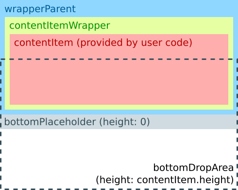
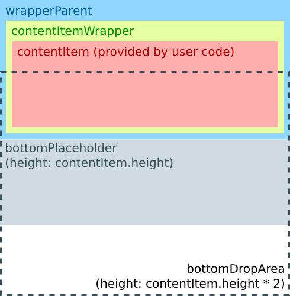

pub_date: 2016-05-08 22:00:09 +01:00
public: true
tags: [Qt, QML, Drag'n'drop]
title: Reordering a Qt Quick ListView via drag'n'drop - part 3
summary: |
    Make it easier for users to see where a dragged item is going to land.

This is the third article in the "Reordering a Qt Quick ListView via drag'n'drop" series. If you haven't read them already, here are [the first](/2016/reordering-a-listview-via-dragndrop-1) and [second](/2016/reordering-a-listview-via-dragndrop-2) articles.

In this final article we are going to show a rectangle at the place where the dragged item is going to be dropped. This gives the user a better understanding of what is going to happen.

Here is what it looks like:

Placeholders are going to be Rectangles with an height of 0 by default. When an item is dragged over them, they will take the height of the dragged item.

To achieve this we need to refactor our code a bit. DraggableItem wraps the list item in `contentItemWrapper`, which is a direct child of DraggableItem, but is reparented to `draggableItemParent` when dragged. To implement placeholders, this won't be enough: if we anchor the placeholder rectangles to `contentItemWrapper` all sort of weird layout issues happen when `contentItemWrapper` is reparented. To avoid this we are going to "wrap the wrapper", by introducing an item which holds `contentItemWrapper` but is never reparented. I had a hard time finding an understandable id for this item, I came up with `wrapperParent`, which is a bit lame, bear with me (I initially used `contentItemWrapperParent`, but it was both lame *and* long).

The new structure of a DraggableItem looks like this:

When a dragged item enters the DropArea, the DraggableItem changes to this:

This time I am providing an abbreviated version of the whole source instead of describing the changes because the changes in this article are not easy to describe progressively. Hopefully the structure diagrams gives you a higher-level view of how placeholders work.

.. sourcecode:: qml

    Item {
        id: root

        // (...)

        width: contentItem.width
        height: topPlaceholder.height + wrapperParent.height + bottomPlaceholder.height

        // (...)

        Rectangle {
            id: topPlaceholder
            anchors {
                left: parent.left
                right: parent.right
                top: parent.top
            }
            height: 0
            color: "lightgrey"
        }

        Item {
            id: wrapperParent
            anchors {
                left: parent.left
                right: parent.right
                top: topPlaceholder.bottom
            }
            height: contentItem.height

            Rectangle {
                id: contentItemWrapper
                anchors.fill: parent
                // (...)
            }
        }

        Rectangle {
            id: bottomPlaceholder
            anchors {
                left: parent.left
                right: parent.right
                top: wrapperParent.bottom
            }
            height: 0
            color: "lightgrey"
        }

        // (...)

        Loader {
            id: topDropAreaLoader
            active: model.index === 0
            anchors {
                left: parent.left
                right: parent.right
                bottom: wrapperParent.verticalCenter
            }
            height: contentItem.height
            sourceComponent: Component {
                DropArea {
                    property int dropIndex: 0
                }
            }
        }

        DropArea {
            id: bottomDropArea
            anchors {
                left: parent.left
                right: parent.right
                top: wrapperParent.verticalCenter
            }
            property bool isLast: model.index === _listView.model.count - 1
            height: isLast ? _listView.contentHeight - y : contentItem.height

            property int dropIndex: model.index + 1
        }

        states: [
            State {
                when: dragArea.drag.active
                name: "dragging"

                ParentChange {
                    target: contentItemWrapper
                    parent: draggedItemParent
                }
                PropertyChanges {
                    target: contentItemWrapper
                    opacity: 0.9
                    anchors.fill: undefined
                    width: contentItem.width
                    height: contentItem.height
                }
                PropertyChanges {
                    target: wrapperParent
                    height: 0
                }
                PropertyChanges {
                    target: root
                    _scrollingDirection: {
                        // (...)
                    }
                }
            },
            State {
                when: bottomDropArea.containsDrag
                name: "droppingBelow"
                PropertyChanges {
                    target: bottomPlaceholder
                    height: contentItem.height
                }
                PropertyChanges {
                    target: bottomDropArea
                    height: contentItem.height * 2
                }
            },
            State {
                when: topDropAreaLoader.item.containsDrag
                name: "droppingAbove"
                PropertyChanges {
                    target: topPlaceholder
                    height: contentItem.height
                }
                PropertyChanges {
                    target: topDropAreaLoader
                    height: contentItem.height * 2
                }
            }
        ]

        // (...)
    }

You may wonder why we are not using a Column or a ColumnLayout to hold the `topPlaceholder`, `wrapperParent` and `bottomPlaceholder` items together. The reason for this is that it makes it impossible to anchor DropAreas: an Item can only be anchored to a sibling or to a parent so if `bottomPlaceholder` were in a Column, `bottomDropArea` could not anchor to it.

Since we no longer need a drop indicator, or rather, since it is now implemented differently, I removed the DraggableItemDropArea component. The code now uses plain DropAreas with a custom `dropIndex` property.

There is one extra hack I added for completeness: when the list contains few elements, the gap between the last item and the bottom of the view can be taller than `contentItem.height / 2`, but the user expects the whole gap to work as a drop target. To implement this I added some special code to the `bottomDropArea` so that if it is the last item of the list, it sets its height to cover the whole gap. Unfortunately, there is no generic way to know if an item is the last one, so the hack relies on the model exposing a `count` property.

This works out of the box for QML ListModel models, but you will have to add this property to your model if your model is based on a C++ QAbstractItemModel. Implementation boils down to returning the value of `QAbstractItemModel::rowCount()` so it's not that much work.

The source code for this article is available in the [associated GitHub repository, under the "3-placeholders" tag][gh]. You can view the changes between the version in this article and the previous one as [a diff][ghdiff].

[gh]: https://github.com/agateau/listviewdragitem/tree/3-placeholders
[ghdiff]: https://github.com/agateau/listviewdragitem/compare/2-drag-scroll...3-placeholders

This article concludes this series on reordering a QML ListView via drag'n'drop. I hope you found it useful.
