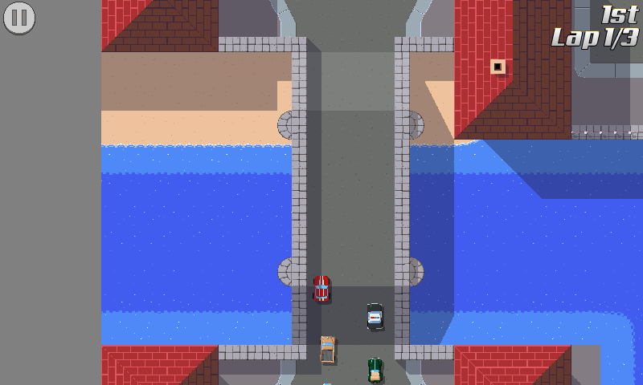

pub_date: 2017-09-25 08:33:21 +01:00
public: true
tags: [tinywheels]
title: Bridge tiles
summary: |
    Drawing bridge tiles for Tiny Wheels.

I spent the last two weeks on [Tiny Wheels][tw] finishing the vehicle diving animation, it's mostly done now. I also drew tiles for the two bridges of "Tiny sur Mer", the map I am working on. I am not super happy with it, but it's better than the bland road tiles that were there before:

It also made me realize using 64x64 tiles was not a good decision. I picked this large size because it made it easier to draw large curves without requiring complicated combination of tiles. This is great for roads but not so much for buildings or other decoration tiles. More and more I find myself drawing elements filling only half a tile, and having to duplicate them to have the same element on the other half.

After the next release I plan to recreate the tileset in 32x32, or as a  mix of 64x64 (for roads) and 32x32 (for decors) if I can make it work.

[tw]: /projects/tinywheels
