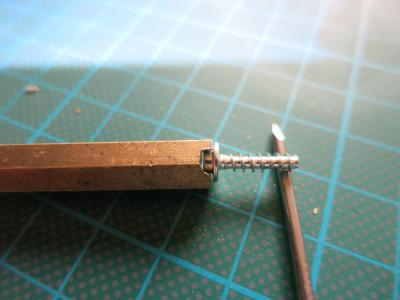

pub_date: 2017-05-07 09:35:41 +01:00
public: true
tags: [DIY, Coffee, Krups]
title: Fixing my coffee machine
summary: |
    Fixing a coffee machine can be harder than it should be.

I like fixing things. At work I fix bugs. At home I (try to) fix toys, appliances, doors, bikes, cars, fences... Whatever breaks. My latest fix was on one of the most critical appliances of the house: the coffee machine!

A capsule got stuck inside it, the piston would not open. "Should be an easy fix", I thought, "it's just a matter of taking it apart to reach the piston and unblock it". I am used to appliances being sometimes painful to take apart. I even bought a "Special PITA screws" screwdriver set:

But I was not prepared for the screws of that coffee machine. Their head is a slightly elliptic stud with no hole at all. Krups really does not want you to take their precious machine apart!

At first I thought I would gave up, but then I found [this video (French)][video] which explained how to beat them: the video author drilled a hole inside a thick screw, enlarged it slightly in one direction, and used that as a screwdriver. My first attempt produced a crude tool, with which I managed to unscrew one screw, but my tool got bent on the second one. My "tool screw" was not thick enough. For my second attempt I scavenged a brass hex strut and sawed a notch in it to produce this:

That worked much better, even if the very last screw required building another one, slightly thinner. I was finally able to remove all the screws, unblock the piston and remove the severely crushed capsule stuck in it. I then put it back together, replaced all those annoying screws with standard ones, and finally enjoyed a cup of coffee!

No thanks to Krups, they really made that more difficult than it should be. That kind of user-hostile product design just leads to producing more unjustified waste.

[video]: https://www.youtube.com/watch?v=CDdAWKuCvhA