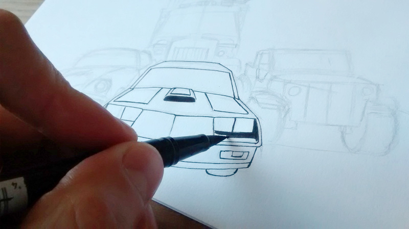

pub_date: 2017-11-02 21:35:41 +01:00
public: yes
tags: [Drawing, Inktober]
title: Inktober 2017
summary: |
    Last month I participated to Inktober.

Last month I participated to [Inktober](http://inktober.com).

In case you don't know what it is, Inktober is a yearly challenge where you have to create an ink drawing every day of the October month and post it online. To help you find inspiration, the Inktober web site provides a word list: one word for each day.

Since I am about to release a new version of [Tiny Wheels](/projects/tinywheels), I decided that in addition to the Inktober word list, all my drawings would feature vehicles. Some days were more difficult than others but I ended up with some interesting combinations, and some drawings relate to each others, for example 1 (Swift), 28 (Fall), 4 (Underwater) and 30 (Found) form a mini story. 2 (Divided) and 29 (United) are related as well.

Here are all the drawings I did:

.. gallery::

    - full: 01.jpg
      alt: Swift
    - full: 02.jpg
      alt: Divided
    - full: 03.jpg
      alt: Poison
    - full: 04-2.jpg
      alt: Underwater
    - full: 05.jpg
      alt: Long
    - full: 06-2.jpg
      alt: Sword
    - full: 07-2.jpg
      alt: Shy
    - full: 08.jpg
      alt: Crooked
    - full: 09.jpg
      alt: Skreech
    - full: 10.jpg
      alt: Gigantic
    - full: 11-1.jpg
      alt: Run
    - full: 12.jpg
      alt: Shattered
    - full: 13.jpg
      alt: Teeming
    - full: 14.jpg
      alt: Fierce
    - full: 15-2.jpg
      alt: Mysterious
    - full: 16.jpg
      alt: Fat
    - full: 17.jpg
      alt: Graceful
    - full: 18.jpg
      alt: Filthy
    - full: 19.jpg
      alt: Cloud
    - full: 20.jpg
      alt: Deep
    - full: 21.jpg
      alt: Furious
    - full: 22.jpg
      alt: Trail
    - full: 23.jpg
      alt: Juicy
    - full: 24.jpg
      alt: Blind
    - full: 25.jpg
      alt: Ship
    - full: 26.jpg
      alt: Squeak
    - full: 27.jpg
      alt: Climb
    - full: 28.jpg
      alt: Fall
    - full: 29.jpg
      alt: United
    - full: 30.jpg
      alt: Found
    - full: 31-1.jpg
      alt: Mask

I tried to do Inktober in 2014, but did not make it past a few drawings. I am happy I made it through the entire month this time. It may not look like it, but it's quite tiring, I felt both happy and relieved when we reached the end of the month, a bit like how it felt to reach the end of a school year.

There is a strong sense of community which emerges from drawing with others on the same theme for a month. You start to follow other participants, and wonder how they are going to interpret the next word. I was a bit skeptical about the word list in the beginning, but it turns out to be a great way to find inspiration and to share something with others.

I had to dug some old pens from my drawers (including a 23 year old grey one, which quickly passed out...) and bought a few new ones. I especially enjoy my large brush-like black pen, I love the feeling of inking with it.

I am not satisfied with all of my drawings, real-life inking is quite unforgiving. There was often a moment when I was like "Oh no... Why did I drew this line?!?" but that's how one learns. I like to think my inking skills improved during this month.

I hope I can do it again next year, but this time I'll get a grey pen for shading, I made way too many hatchings during this month! I also drew too many wheels :)
