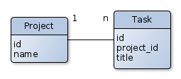

public: false
tags: [yokadi, orm, sql, sqlalchemy]
title: ORM do not always make code simpler
summary: |
    How Yokadi ORM got in the way and made code more complicated than expected.

Last week I added a new command to [Yokadi][]: `p_merge`. This command lets you merge a project into another. Yokadi uses SQLite to store its tasks, with a reasonably straightforward structure. The simplified version looks like this:

[Yokadi]: https://yokadi.github.io



With such a structure, merging project A into project B is just a matter of assigning all tasks of A to B and deleting A. In plain SQL this looks like this:

```
update task set project_id=<id_of_project_B> where project_id=<id_of_project_A>;
delete from project where id=<id_of_project_A>;
```

Yokadi does not access its database using plain SQL though, it uses an ORM called [SQLAlchemy][]. An ORM (Object Relational Mapper) maps tables of a relational database to objects, making a lot of tasks easier to do. My first implementation looked like this:

[SQLAlchemy]: http://www.sqlalchemy.org

```
project_a = session.query(Project).get(project_a_id)
project_b = session.query(Project).get(project_b_id)
for task in project_a.tasks:
    task.project = project_b
session.delete(project_a)
```

That looks reasonably straightforward: retrieve Project objects for the two projects, change the project of `project_a` tasks and delete `project_b`.

Only problem with this code is that tasks which used to be assigned to `project_a` gets deleted when `project_a` is deleted (assuming you are using cascading deletes).

How can this be since we assigned a new project to the tasks?
