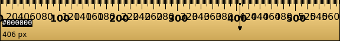

pub_date: 2017-06-19 19:27:26 +01:00
public: true
tags: [KDE, pko, KRuler]
title: Pimping KRuler
summary: |
    I spent some time improving KRuler, making it look a bit nicer.

KRuler, in case you don't know it, is a simple software ruler to measure lengths on your desktop. It is one of the oldest KDE tools, its first commit dating from November 4th, 2000. Yes, it's almost old enough to vote.

I am a long time KRuler user. It gets the job done, but I have often found myself saying "one day I'll fix this or that". And never doing it.

Hidpi screen really hurt the poor app, so I finally decided to do something and spend some time during my daily commute on it.

This is what it looked like on my screen when I started working on it:

As any developer would, I expected it should not be more than a week of work... Of course it took way longer than that, because there was always something odd here and there, preventing me from pushing a patch.

I started by making KRuler draw scale numbers less often to avoid ugly overlapping texts. I then made it draw ticks on both sides, to go from 4 orientations (North, South, West, East) to  2: vertical or horizontal.

The optional rotation and buttons were getting in the way though: the symmetric ticks required the scale numbers to be vertically centered so buttons were overlapping it. I decided to remove them (they were already off by default). With only two orientations it is less useful to have rotation buttons anyway: it is simple enough to use either the context menu, middle-click the ruler, or the `R` shortcut to change the orientation. Closing is accessible through the context menu as well.

One of the reasons (I think) for the 4 orientations was the color picker feature. It makes little sense to me to have a color picker in a ruler: it is more natural to use KColorChooser to pick colors. I removed the color picker, allowing me to remove the oddly shaped mouse cursor and refresh the appearance of the length indicator to something a bit nicer.

I then made it easier to adjust the length of the ruler by dragging its edges instead of having to pick the appropriate length from a sub-menu of the context menu. This made it possible to remove this sub-menu.

This is what KRuler looks like now:

That is only part 1 though. I originally had 2 smaller patches to add, but Jonathan Riddell, who kindly reviewed the [monster patch][1], requested another small fix, so that makes 3 patches to go. Need to setup and figure out how to use Arcanist to submit them to Phabricator, as I have been told Review Board is old school these days :)

[1]: https://git.reviewboard.kde.org/r/130152/
