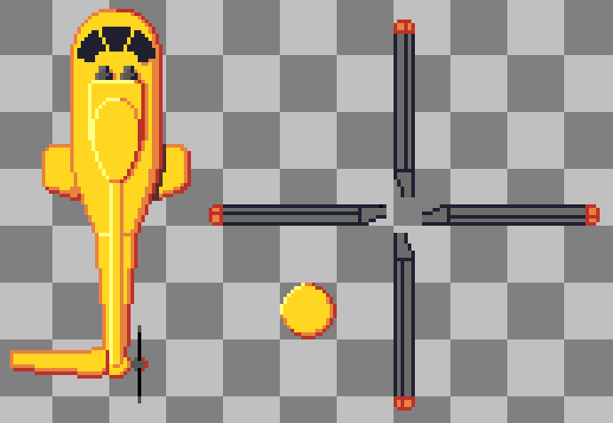

pub_date: 2017-09-08 19:42:21 +01:00
public: true
tags: [pixelwheels, gamedev]
title: Rescue copter
summary: |
    Drawing the rescue helicopter in Tiny Wheels.

The recovery animation of drowning vehicles in [Tiny Wheels][tw] is making some progress. Vehicles no longer levitate back to the track: an helicopter flies in and actually pick them up, see for yourself:

<video width="800" height="480" controls>
  <source src="rescue.webm" type="video/webm">
</video>

The animation is not fully finished yet: I want to draw the vehicles a bit bigger when they are in the air. When this is done, it should be good enough.

The helicopter comes from a nice line drawing of the Super Puma I found on [Wikipedia][sp]. I compressed it a bit vertically to match the proportions of the other elements in the game, then pixelled it in 3 parts: the body, the propeller and the propeller top.

At first I didn't like the yellowish color of it, but it's growing on me. What do you think?

[tw]: /projects/pixelwheels
[sp]: https://en.wikipedia.org/wiki/Eurocopter_AS332_Super_Puma
