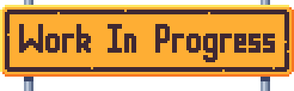

pub_date: 2017-11-05 18:47:44 +01:00
public: true
tags: [pixelwheels]
title: Tiny Wheels 0.3.0!
summary: |
    I finally released version 0.3.0 of Tiny Wheels.

Here it is: [Tiny Wheels 0.3.0][tw]!

Beware, the game is hard, unfair and unfinished, with the occasional bug here and there. The "Work in progress" pane on the title screen is here for a reason... Having said that, if you are willing to bare with its rough state, you can already have fun playing the game and tweaking it!

For now it features 3 tracks, 5 cars, 3 different bonuses, one-player and two-player-split-screen modes (on desktop only).

For the tinkerers among you, you can find a "Debug" button in the bottom-right corner of the Settings screen, which will open a Debug screen where you can adjust a lot of game parameters. This screen will likely disappear or become harder to find in future versions, but for now feel free to play with the values in there! Let me know if you come up with some settings which make the game nicer to play. Debug changes are kept in `~/.local/share/tinywheels/debug.xml` if you want to share them.

That's it, you can now head over to the [game page][tw] to download the latest version. I hope you have as much fun with Tiny Wheels as I am having while working on it! Let me know your thoughts and suggestions in the comments.

Oh and Tiny Wheels is now free software! You can get the source code from [GitHub][gh].

PS: If you have been following me on Mastodon or Twitter, this release of Tiny Wheels is the reason I decided to feature cars or other vehicles in all the drawing I did for [Inktober](../inktober).

[gh]: https://github.com/agateau/tinywheels
[tw]: /projects/pixelwheels
