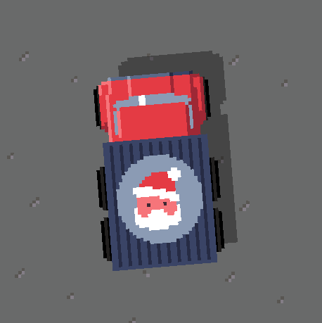
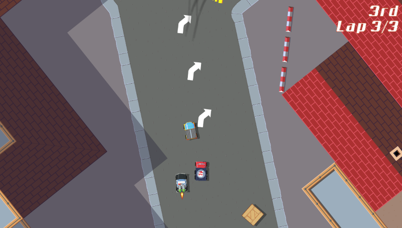
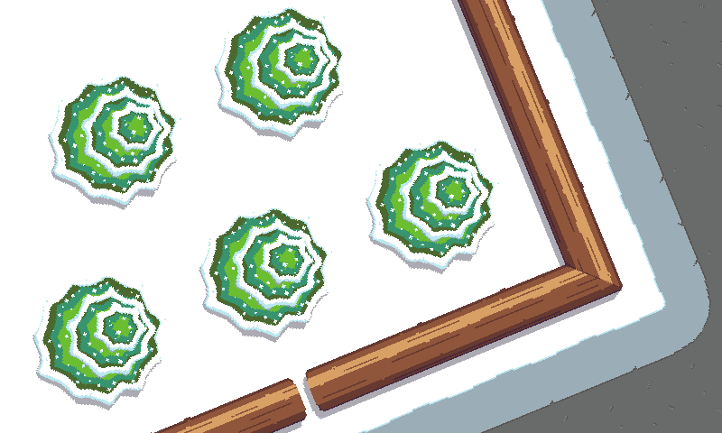

pub_date: 2017-12-03 21:56:09 +01:00
public: true
tags: [tinywheels]
title: Tiny Wheels 0.4.0, Christmas Edition!
summary: |
    A new version of Tiny Wheels is out, with a Christmas surprise...

We are getting close to Christmas, so I just released a new version of Tiny Wheels with a special vehicle, just for the occasion. Introducing... Santa truck!

This truck is the first 6-wheeled vehicle of the game, it's also the first one with 4 steering wheels: the wheels from the middle axle steer half as much as the front axle wheels.

The main focus of this release was to try to make the game easier. To achieve this, I made the following changes:

- I added road indicators so that you can anticipate curves:

- Maps have been made less tricky: there are less places where you can get stuck, requiring you to reverse. Additionally the infamous wood bridge in Tiny sur Mer is a bit more forgiving: you can drive a bit in the water around it before drowning.

- I adjusted steering so that the vehicles do not go straight to the next wall if you press left or right at high speed, especially when the turbo is on.

- Finally I made AI vehicles in front of you drive a bit slower, making it easier to catch up. This is similar to what (I assume) Mario Kart does.

I also reworked the tiles of the snow track: they are now real pixel-art (they used to come from an SVG document because they were created before I decided to go pixel-art) and the pine-trees are now covered with snow:

You can find the complete list of changes in the [changelog][].

Get this release from [Tiny Wheels page](/projects/tinywheels/) or, for Android users, on [Google Play][gp]!

[changelog]: https://github.com/agateau/tinywheels/blob/master/CHANGELOG.md
[gp]: https://play.google.com/apps/testing/com.agateau.tinywheels.android
