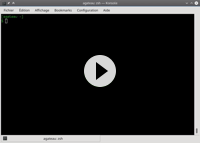

pub_date: 2018-03-30 21:43:30 +01:00
public: true
tags: [cmake, pko]
title: CMakeDoc

CMake reference documentation is built inside the `cmake` binary itself, accessible through `--help-*` options. This is useful, but not really practical: you have to remember the exact command name, and pipe the output to a pager. I wanted something more user (or developer) friendly.

<!-- break -->

A long time ago (in 2010!) I created a Python command-line tool called CMakeDoc to make this documentation easier to read. You start it with one or more search criteria (they don't have to be complete words) and it prints a list of all matching commands, properties, variables or modules CMake knows. You then type the number of the piece of documentation you want to read: CMakeDoc shows you this documentation using `less` or the pager defined in `$PAGER`.

That's all there is to it. It's a small tool, but it's saved me quite some time over the years. It's been available [on GitHub](https://github.com/agateau/cmakedoc) for a long time, but last week I decided to give it a bit more visibility: I adjusted a few things, created a `setup.py` for it, extended the README.md and released it on PyPI.  You can now install it with a simple `pip3 install cmakedoc` command.

Fun fact: CMakeDoc was originally called CMakeHelp, but when I tried to upload it to PyPI, I found out there was already a CMakeHelp tool there, which looks abandoned and does not install, but forced me to rename the project nevertheless to be able to host it there. I seem to be making a habit of [renaming my projects because of name conflicts][rename] :)

[rename]: ../pixelwheels-0-6-0
