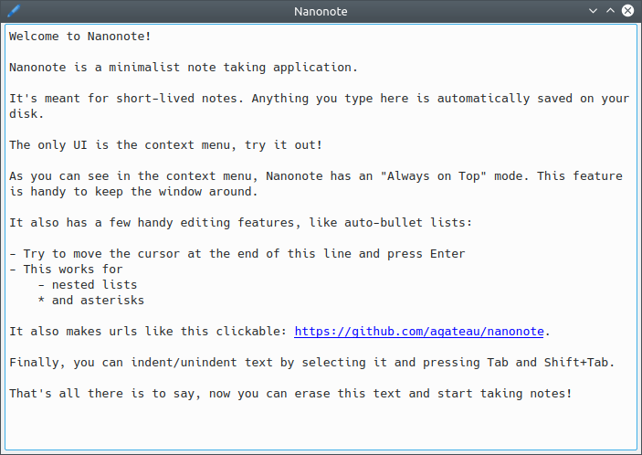

pub_date: 2018-12-30 11:23:01 +01:00
public: true
tags: [release-month, nanonote, qt, pko]
title: Release month, Nanonote 1.0.0

Here is the last issue of release month! Today is the first release of [Nanonote][nn], a minimalist note-taking application.

Quoting the README:

> It automatically saves anything you type in the screen on your disk. Being minimalist means it has no synchronisation, does not support multiple documents, images or any advanced formatting (the only formatting is highlighting urls). If you have long-lived notes you should store them in a more permanent place.

[nn]: https://github.com/agateau/nanonote

<!-- break -->

I built a very early version of Nanonote a little more than a year ago and since then I have been using it at work almost every day. I use it to take notes when I am investigating bugs or diving into a new code base, collecting links to pull requests and CI builds, whatever I need. It is basically an eco-friendly blank sheet.

The way I use it shaped some of the features like "Always on Top",
auto bullet-lists or the ability to indent and unindent text blocks with Ctrl+I and Ctrl+U (handy with nested lists).

Nanonote is built with Qt 5 and uses QWidgets, this might sound old-school, but it's lightweight, it works and QWidget `QPlainTextEdit` is superior to QtQuick Controls 2 `TextArea` at the moment, for example by providing a decent context menu.

There aren't any pre-compiled binaries for the moment, so you need to build it yourself. See the [README][nn] for details.

That's the end of release month, I hope you enjoyed these releases!
